# CloudFlare


## Pages


### 介绍

**Cloudflare Pages**是Cloudflare公司推出的一个静态网站托管服务，专为开发者提供构建和部署现代化、高性能网站的解决方案。以下是关于Cloudflare Pages的详细介绍：

**一、核心特点**

1. **与GitHub无缝集成**：
   - 支持自动从GitHub仓库获取代码，并触发构建和部署。
   - 开发者只需将代码推送到GitHub仓库，Cloudflare Pages即可自动处理静态内容的生成、构建和部署。
2. **免费SSL和全球CDN加速**：
   - 提供免费的SSL证书，确保网站的安全性。
   - 利用Cloudflare遍布全球的CDN网络，实现网站的快速分发和访问，提升用户访问速度。
3. **JAMstack架构**：
   - 采用JAMstack（JavaScript、APIs、Markup）架构，兼具静态网站的高性能和动态网站的灵活性。
   - 支持部署各种类型的应用，包括纯静态网站、动态网页应用和API等。
4. **无限带宽和请求**：
   - 所有计划均提供无限站点、席位、请求和带宽，满足各种规模项目的需求。
5. **高级协作功能**：
   - 内置高级协作功能，支持团队成员之间的协作和部署。
   - 为每次提交自动生成唯一、受保护的链接，方便团队成员预览和反馈。
6. **隐私优先的分析工具**：
   - 提供隐私优先的Web分析工具，帮助开发者获取对页面的实时洞察。

**二、使用步骤**

使用Cloudflare Pages创建静态网站的基本步骤如下：

1. **注册Cloudflare帐户**：
   - 前往Cloudflare Pages的官方网站，注册并登录Cloudflare帐户。
2. **创建新项目**：
   - 在Cloudflare Pages的控制台中，点击“创建项目”按钮。
   - 选择GitHub作为代码源，并连接您的GitHub账户。
3. **选择代码仓库**：
   - 在您的GitHub存储库列表中，选择您要部署的存储库。
   - 配置构建脚本和输出目录，设置项目的构建命令和存放构建的页面的目录。
4. **触发构建和部署**：
   - 点击“保存并部署”按钮，Cloudflare Pages将自动从GitHub仓库拉取代码并构建应用程序。
   - 构建完成后，应用程序将被部署到Cloudflare的CDN网络中，并通过指定的域名进行访问。
5. **绑定自定义域名（可选）**：
   - 如果您希望使用自己的域名，可以在域名管理后台添加一条CNAME记录，指向默认的“pages.dev”域名。

**三、定价方案**

Cloudflare Pages提供多种定价方案，以满足不同用户的需求：

- **免费计划**：
  - 提供基本功能和无限带宽，适合个人项目或小型网站。
- **Pro计划（20/月或25/年）**：
  - 提供更多的资源额度和功能，适合专业开发者和团队。
  - 支持5个并发构建，每月5000次构建，每个项目250个自定义域名。
- **Business计划（200/月或250/年）**：
  - 提供企业级高级功能和优先支持。
  - 支持20个并发构建，每月20000次构建，每个项目500个自定义域名。

**四、优势分析**

1. **性能出色**：
   - 利用Cloudflare遍布全球的CDN网络，实现网站的快速分发和访问。
   - 支持HTTP/3、QUIC等最新Web标准，提供更快的加载速度和更好的用户体验。
2. **安全可靠**：
   - 提供免费的SSL证书，确保网站的安全性。
   - 具备DDoS防护、内容安全策略（CSP）等多种安全特性，保护网站免受网络攻击和数据泄露等威胁。
3. **灵活定价**：
   - 提供多种定价方案，满足不同用户的需求和预算。
   - 免费计划即包含无限带宽和请求，对成本敏感的中小项目尤为友好。
4. **易用性强**：
   - 与GitHub无缝集成，支持自动构建和部署，简化开发流程。
   - 提供丰富的设置选项和文档支持，帮助开发者快速上手。

**五、适用场景**

- **个人博客与作品集**：
  - 开发者可以轻松搭建个人博客或作品集网站，展示自己的作品和想法。
- **静态网站与Web应用**：
  - 对于需要快速构建和部署静态网站或Web应用的场景，Cloudflare Pages是一个理想的选择。
- **API与微服务**：
  - 通过与Cloudflare Workers的结合，开发者也可以轻松构建API和微服务，满足各种复杂的应用场景需求。

**六、总结**

Cloudflare Pages是一个功能强大、性能出色、安全可靠的静态网站托管服务。凭借与GitHub的无缝集成、免费SSL和全球CDN加速等核心特点，以及灵活定价和易用性强等优势，Cloudflare Pages成为许多开发者的首选。无论是个人项目还是中小型企业网站，Cloudflare Pages都能提供出色的托管服务。


### 发布 VitePress


#### 连接 GitHub 方式

>注意：推荐使用此方式发布。
>
>通过此方式发布 GitHub 项目，需要完整地克隆仓库有可能会导致 LFS 流量超出免费额度，所以需要注意发布 GitHub 仓库的大小。

步骤如下：

1. 访问 `https://dash.cloudflare.com` 登录 Cloudflare 控制台
2. 导航到 Pages 产品后，点击 `Create` 按钮以创建 Application
3. 点击切换到 Pages 标签页，点击 `Connect to Git` 按钮跳转到 GitHub/GitLab 信息配置页面
4. 点击 `Add account` 按钮添加 GitHub 帐号，填写信息如下：
   - GitHub account 选择 `刚刚授权的 GitHub 帐号`
   - Select a repository 选择 `刚刚授权的 GitHub 仓库`
5. 点击 `Begin setup` 按钮跳转到构建和部署设置界面，填写信息如下：
   - Project name 为不需要填写使用 GitHub 仓库名称即可
   - Production branch 为 GitHub 仓库需要构建和部署的分支（Cloudflare 会自动选择主干分支）
   - Framework preset 选择 `VitePress`
   - Build command 使用默认值（Cloudflare 会自动生成）。如果 VitePress 项目配置使用 docs 目录则填写 `npm run docs:build` 命令
   - Build output directory 使用默认值（Cloudflare 会自动生成）。如果 VitePress 项目配置使用 docs 目录则填写 `docs/.vitepress/dist`
   - Root directory 不填写。如果 VitePress 项目在 GitHub 仓库中不在根目录中，则需要指定 VitePress 项目在 GitHub 仓库中所在的路径，例如：publisher/vitepress
6. 点击 `Save and Deploy` 按钮会自动构建和部署 VitePress 项目
7. 等自动构建和部署完毕后，访问 `xxx.pages.dev` 即可
8. 禁用自动发布：修改 Application 的设置 Branch control，取消勾选 Enable automatic production branch deployments。


#### 手动上传方式

>注意：不知道什么原因通过此方式发布 demonstration 项目的 VitePress css 文件会无法下载，所以不使用此方式发布 VitePress 文档。
>
>本地编译后，手动上传 html、js、css 到 Cloudflare。

步骤如下：

1. 编译基于 VitePress 的文档项目

   ```bash
   npm run docs:build
   ```

   - 编译后的相关文件位于 docs/.vitepress/dist 目录中

2. 登录 CloudFlare 控制台创建 Pages 并使用 `Create using direct upload` > `Upload assets` 功能直接上传 docs/.vitepress/dist 目录

3. docs/.vitepress/dist 目录上传完毕后点击 `Deploy` 按钮部署文档。


### 绑定 CloudFlare 域名到 Pages

>提示：Pages 绑定非默认域名和 <a href="/cloudflare/README.html#为站点配置-cdn" target="_blank">为站点配置 CDN</a> 原理相似。

默认情况下 Pages 会自动生成 xxx.pages.dev 的域名，但此域名在国内访问不稳定。下面介绍如何申请 CloudFlare 域名并绑定到 Pages 中。

步骤如下：

1. 参考 <a href="/cloudflare/README#申请域名" target="_blank">CloudFlare 申请域名</a> 先申请域名
2. 登录 CloudFlare 控制台并导航到对应的 Pages 项目中，切换到 ` Custom domains` 标签页
3. 点击 `Set up a custom domain` 按钮跳转到自定义域名信息填写页面，填写信息如下：
  - Domain 为 `上面步骤 1 申请到的域名`
4. 点击 `Continue` 按钮跳转到 `Confirm new DNS record` 界面，确认信息无误后点击 `Activate domain` 按钮
5. 等待片刻后以上添加的域名会自动变化为 `Active` 状态。
6. 使用浏览器访问 `https://域名` 即可访问 Pages 发布的内容


### 绑定非 CloudFlare 外部域名到 Pages

>提示：Pages 绑定非默认域名和 <a href="/cloudflare/README.html#为站点配置-cdn" target="_blank">为站点配置 CDN</a> 原理相似。

默认情况下 Pages 会自动生成 xxx.pages.dev 的域名，但此域名在国内访问不稳定。下面介绍如何申请非 CloudFlare 外部域名并绑定到 Pages 中。

步骤如下：

1. 参考 <a href="/cloudflare/README#添加外部域名到-cloudflare" target="_blank">添加外部域名到 CloudFlare</a> 先添加外部域名到 CloudFlare
7. 登录 CloudFlare 控制台并导航到对应的 Pages 项目中，切换到 ` Custom domains` 标签页
8. 点击 `Set up a custom domain` 按钮跳转到自定义域名信息填写页面，填写信息如下：
   - Domain 为 `上面步骤 1 申请到的域名`
9. 点击 `Continue` 按钮跳转到 `Confirm new DNS record` 界面，确认信息无误后点击 `Activate domain` 按钮
10. 等待片刻后以上添加的域名会自动变化为 `Active` 状态。
11. 使用浏览器访问 `https://域名` 即可访问 Pages 发布的内容


## DNS

### 代理状态（Proxy status）

>[CloudFlare 官方文档解析 Proxy Status](https://developers.cloudflare.com/dns/proxy-status/)

虽然您的 DNS 记录使您的网站或应用程序可供访问者和其他 Web 服务使用，但 DNS 记录的代理状态定义了 Cloudflare 如何处理该记录的传入 DNS 查询。

例子如下：

**example.com** 的 DNS 管理：

| Type | Name   | Content     | Proxy status | TTL  |
| ---- | ------ | ----------- | ------------ | ---- |
| A    | `blog` | `192.0.2.1` | Proxied      | Auto |
| A    | `shop` | `192.0.2.2` | DNS only     | Auto |

在上面的示例 DNS 表中，有两个 DNS 记录。名为 blog 的记录已启用代理，而名为 shop 的记录已禁用代理（即仅 DNS）。

这意味着：

- 对代理记录 blog.example.com 的 DNS 查询将使用 Cloudflare 任播 IP 地址而不是 192.0.2.1 进行应答。这可确保针对此名称的 HTTP/HTTPS 请求将发送到 Cloudflare 的网络并可进行代理，从而实现上述优势。
- 对仅 DNS 记录 shop.example.com 的 DNS 查询将使用实际原始 IP 地址 192.0.2.2 进行应答。除了暴露您的原始 IP 地址并且无法从多项功能中受益之外，Cloudflare 无法对这些请求提供 HTTP/HTTPS 分析（仅提供 DNS 分析）。


## CDN

### 介绍

CloudFlare CDN，即Cloudflare提供的内容分发网络（Content Delivery Network）服务，是一种基于反向代理的技术，旨在优化网站的请求处理机制，提升访问速度和可靠性。以下是对CloudFlare CDN的详细介绍：

一、定义与工作原理

CloudFlare CDN通过在全球多个数据中心分布服务器，使用户能够从最近的服务器获取网站内容。这种分布式架构有助于减少网络延迟，提高内容传输速度。当用户请求访问某个网站时，CloudFlare的CDN会首先接收请求，并根据用户的位置和请求的内容，从最近的节点提供缓存的内容或回源服务器获取内容后缓存并提供给用户。

二、功能与优势

1. **加速网站访问**：CloudFlare CDN通过缓存静态和动态内容，减少了对源服务器的请求，从而加快了网站的加载速度。
2. **提高安全性**：CloudFlare提供了包括SSL/TLS加密、DDoS保护、WAF（Web应用防火墙）以及针对SQL注入、XSS等常见攻击的防护在内的安全防护功能，有效保护网站免受恶意攻击和数据泄露的风险。
3. **优化性能**：CloudFlare CDN能够智能地根据设备、浏览器和带宽需求优化内容传输，提供更佳的用户体验。
4. **降低成本**：通过减少对源服务器的请求和最小化带宽消耗，CloudFlare CDN有助于降低网站的托管费用。
5. **易于配置和使用**：CloudFlare提供了简单直观的界面和丰富的配置选项，使得即使是非技术背景的用户也能轻松上手。

三、免费与付费服务

CloudFlare提供了免费的CDN服务，这对于预算有限的小型网站或初创企业来说是一个巨大的福音。尽管是免费的，但其功能并不逊色，包括上述的加速、安全防护和优化性能等功能。然而，对于需要更高性能、更多功能和更专业支持的用户来说，CloudFlare也提供了多种付费计划供选择。

四、使用步骤与注意事项

1. **注册与登录**：访问[CloudFlare官网](https://www.cloudflare.com/)，注册一个账号并登录到管理后台。
2. **添加站点**：在管理后台中点击“添加站点”按钮，并输入想要加速的网站的域名。CloudFlare会自动扫描该域名的DNS记录，并将其导入到系统中。
3. **选择套餐计划**：CloudFlare提供了多种套餐计划，包括免费的计划。对于大多数小型网站或初创企业来说，选择免费计划即可满足需求。
4. **更改DNS服务器**：为了将网站接入CloudFlare的CDN服务，需要将域名的DNS服务器更改为CloudFlare提供的DNS服务器。这通常涉及到在域名注册商处修改DNS设置。
5. **配置CDN设置**：一旦DNS服务器更改生效，就可以开始配置CloudFlare的CDN设置了。这包括开启HTTPS、配置缓存规则、设置防火墙规则等。CloudFlare提供了详细的配置指南和帮助文档，可以帮助用户顺利完成这些设置。
6. **验证效果**：完成所有设置后，可以使用站长工具或Ping命令来测试网站是否已经成功接入CloudFlare的CDN服务，并观察网站的加载速度是否有所提升。

在使用CloudFlare CDN时，需要注意以下几点：

- 对于国内域名，若网站主要访问来自国内，使用国外的CDN可能并非必要。但若网站需频繁接收国外访问，则非常推荐使用CloudFlare CDN，且付费版本可能效果更佳。
- CloudFlare的WAF规则相当灵活自由和强大，因此需要经常性地根据自己站点的情况调整WAF规则，以减小误拦截。

综上所述，CloudFlare CDN是一种功能强大且易于使用的服务，能够帮助网站提升访问速度、增强安全性并提供详细的性能分析报告。无论是对于小型网站还是大型网站来说，都是一个值得考虑的选择。


### 为站点配置 CDN

`https://bunny.net/`、`https://cdn77.com`、CloudFlare CDN 的抽象配置步骤如下：

- 配置源站 IP 地址
- CDN 提供商自动生成或者允许用户指定前缀部分的 CDN Hostname，通过 CDN Hostname 能够访问到源站数据，例如：bunny.net 允许用户指定前缀部分的 CDN Hostname 为 **fut8**，完整的 CDN Hostname 为 **fut8.b-cdn.net**
- 在域名提供商控制面板中删除域名提供上的 NameServers，新增 CDN 提供商提供的 NameServers
- 在 CDN 提供商 DNS 功能中新增一条 CName 记录为 www.xxx.com 到 CDN Hostname 的映射。


步骤如下：

1. 参考 <a href="/cloudflare/README#添加外部域名到-cloudflare" target="_blank">添加外部域名到 CloudFlare</a> 先添加外部域名到 CloudFlare
2. 如果使用 CloudFlare 域名则参考 <a href="/cloudflare/README#申请域名" target="_blank">CloudFlare 申请域名</a> 先申请域名
3. 在 DNS records 中添加类型为 A 的 DNS 记录，信息如下：
   - Type 为 A
   - Name 为子域名或者原来的域名，例如：子域名 www.xxx.com、或者 xxx.com
   - Content 为源站点的 IP 地址
   - Proxy status 为启用状态，关于 Proxy Status 的用法请参考 <a href="/cloudflare/README.html#代理状态-proxy-status" target="_blank">链接</a>
   - TTL 为 Auto
4. 如果源站点为非 80 端口，可以通过新增 Rules > Origin Rules 对目标端口重写，Origin Rules 信息如下：
   - Rule name 填写 port-rewriting
   - If incoming request match ... 选择 All incoming requests
   - Destination port 选择 Rewrite to ... 并填写对应的端口
5. 点击 `Deploy` 按钮 Origin Rules 即可生效
6. 通过 `https://www.xxx.com` 访问 CDN 服务。


## Domain Registration

### 申请域名

步骤如下：

1. 访问 `https://dash.cloudflare.com` 登录 Cloudflare 控制台
2. 导航到 `Domain Registration` > `Register Domains` 功能，填写信息如下：
   - Search for a domain name 填写 `将要申请的域名`
3. 点击 `Search` 按钮搜索域名的价格和相关推荐域名的价格
4. 选中其中需要购买的域名点击 `Confirm` 按钮
5. 填写域名需要绑定的相关信息和信用卡信息后点击 `Complete purchase` 按钮购买即可。


### 管理域名

>[CloudFlare 域名管理官方文档](https://developers.cloudflare.com/registrar/account-options/domain-management/)


### 添加外部域名到 CloudFlare

步骤如下：

1. 登录 `https://namecheap.com` 并申请域名
2. 登录 CloudFlare 控制台并导航到 `Account Home` 功能，点击 `Add a domain` 按钮跳转到域名信息界面，填写信息如下：
   - Enter an existing domain 为 `需要新增的外部域名`
   - 选择 Quick scan for DNS records 选项 CloudFlare 会自动导入域名已存在的 DNS 记录。
3. 点击 `Continue` 按钮跳转到 Select a plan for `外部域名` 并选择 Free 计划后点击 `Continue` 按钮跳转到 `Review your DNS records` 界面
4. 在外部域名提供商的控制台中填写 CloudFlare 提供的两个 NameServers（让外部域名 NS 记录指向 CloudFlare NameServers），如：xxx.ns.cloudflare.com
5. 上面步骤填写完毕后不需要修改 DNS records 任何信息点击 `Continue to activation` 按钮
6. 稍等 30 分钟左右新增的外部域名会自动变为 Active 状态。


## Websocket 代理

### 介绍

Cloudflare WebSocket代理是一种利用Cloudflare的内容分发网络（CDN）和安全服务来保护和加速WebSocket连接的方法。WebSocket是一种在Web浏览器和服务器之间进行全双工通信的协议，它可以实现实时数据传输和交互。而Cloudflare作为全球最大的免费CDN服务商，其服务可以帮助保护和加速这些连接。

以下是如何使用Cloudflare进行WebSocket代理的步骤概述：

1. 准备域名：
   - 你可以使用一个免费或付费的域名。
2. 注册Cloudflare并添加域名：
   - 注册Cloudflare账户，并将你的域名添加到Cloudflare中。
   - 根据提示更改域名的DNS解析到Cloudflare。
3. 配置DNS解析：
   - 在Cloudflare的域名详情页面，点击DNS选项卡，添加一个解析记录。
   - 例如，如果你的域名是`example.com`，并且你想要使用`ws.example.com`作为WebSocket的域名，你可以在DNS那里配置Name为`ws`，IPv4 address写你的服务器IP，并确保选择了“Proxied”（即橙色云图标状态），这样Cloudflare就会代理你的WebSocket流量。
4. 配置SSL/TLS：
   - 在Cloudflare的域名详情页面，点击SSL/TLS选项卡，选择适当的SSL/TLS模式。
   - 对于WebSocket，通常建议选择“Full”模式，以确保WebSocket握手期间的HTTPS请求得到保护。
5. 服务器配置：
   - 在你的服务器上，确保WebSocket服务正在运行，并且配置为监听来自Cloudflare的流量。
   - 你可能需要配置防火墙或安全组规则，以允许来自Cloudflare的IP地址范围的流量。
6. 测试WebSocket连接：
   - 使用WebSocket客户端（如浏览器中的JavaScript代码或专门的WebSocket测试工具）尝试连接到你的Cloudflare代理域名（例如`ws://ws.example.com`或`wss://ws.example.com`）。
   - 确保连接成功，并且数据可以在客户端和服务器之间实时传输。

需要注意的是，使用Cloudflare进行WebSocket代理时，可能会遇到一些问题，如“websocket: bad handshake”错误。这通常意味着客户端与服务器之间的握手过程失败了。解决此类问题可能需要从多个角度进行排查，包括但不限于Cloudflare的配置、服务器的设置、中间件以及客户端环境等。

此外，Cloudflare提供了丰富的文档和社区支持，如果你在配置或使用过程中遇到问题，可以查阅Cloudflare的官方文档或寻求社区的帮助。

总的来说，使用Cloudflare进行WebSocket代理可以带来诸多好处，如提高连接的速度和可靠性、增强安全性以及简化配置和管理等。然而，也需要注意配置的正确性和兼容性等问题，以确保WebSocket连接能够正常工作。


### 配置步骤

>提醒：CloudFlare 代理的配置可以通过本站 [SpringBoot Websocket 示例](https://gitee.com/dexterleslie/demonstration/tree/master/demo-spring-boot/demo-spring-websocket/spring-websocket) 协助测试。
>
>[参考链接](https://developers.cloudflare.com/network/websockets/)

Websocket 源站 IP 地址：35.209.82.60，端口：8085

登录您的 Cloudflare 帐户并转到 `特定域` > `网络` > `WebSockets`，将开关切换至开启

在域名中添加如下的 DNS A 类型记录（注意：需要打开 Proxied，否则 CloudFlare 直接解析 socket.example.com 为 Websocket 源站 IP 地址）

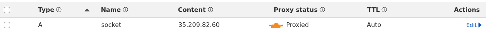

在域名 Rules 中添加一条 Origin Rules 用于修改 Websocket 连接目标端口为 8085

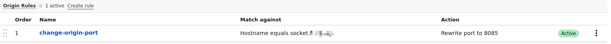


## SSL/TLS 设置


### 加密模式

>[官方参考链接](https://developers.cloudflare.com/ssl/origin-configuration/ssl-modes/)

您的区域的 SSL/TLS 加密模式控制 Cloudflare 如何管理两个连接：一个在您的访问者和 Cloudflare 之间，另一个在 Cloudflare 和您的原始服务器之间。

如果可能，Cloudflare 强烈建议使用“完整”或“完整（严格）”模式来防止恶意连接到您的源站。

加密模式如下：

- **Off (not secure)**：未应用加密。关闭 SSL 会禁用 HTTPS，并导致浏览器显示警告，提示您的网站不安全。
- **Flexible**：仅在访问者和 Cloudflare 之间启用加密。这将避免浏览器安全警告，但 Cloudflare 和您的源之间的所有连接都是通过 HTTP 建立的。
- **Full**：启用端到端加密。当您的源服务器支持 SSL 认证但不使用有效的、公开信任的证书时，请使用此模式。
- **Full (Strict)**：启用端到端加密并强制验证原始证书。使用 Cloudflare 的 Origin CA 为您的原始证书生成证书。
- **Strict (SSL-Only Origin Pull)**：在 Cloudflare 和您的源站之间强制加密。使用此模式可确保与您的源站的连接始终加密，无论您的访问者提出什么请求。

如图所示加密模式功能：

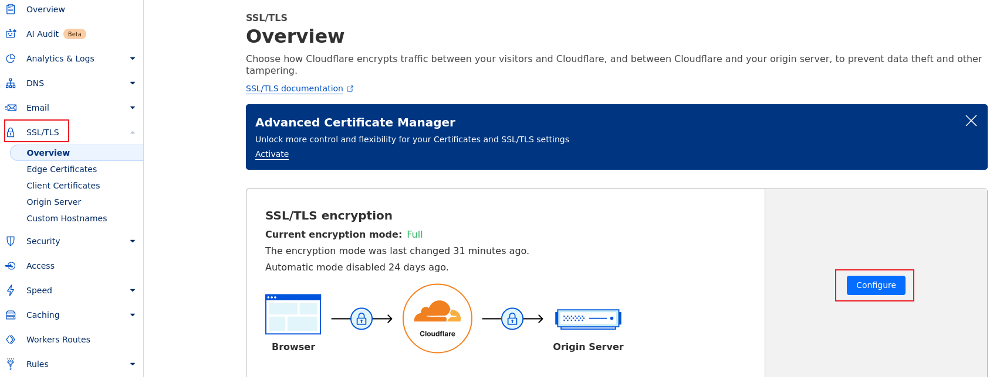


## Zero Trust

### 介绍

Cloudflare Zero Trust是Cloudflare提供的一种IT安全模型，它要求对所有尝试访问专用网络资源的用户和设备进行严格的身份验证，无论它们位于网络边界的内部还是外部。以下是对Cloudflare Zero Trust的详细解释：

一、定义与原理

Cloudflare Zero Trust是一种全面的网络安全方法，它结合了几种不同的安全原则和技术，如零信任网络访问（ZTNA）、身份验证、访问控制等。这种模型的核心思想是“永不信任，始终验证”，即每次访问都需要经过身份验证和授权，以确保网络资源的安全性。

二、主要功能

1. **严格的身份验证**：Cloudflare Zero Trust要求对每次访问都进行身份验证，包括用户和设备。这可以通过多种方式进行，如密码、生物识别、数字证书等。
2. **细粒度的访问控制**：根据用户的身份、设备状态、访问时间和地点等因素，Cloudflare Zero Trust可以实施细粒度的访问控制策略。这可以确保只有符合条件的用户才能访问特定的网络资源。
3. **实时威胁监测与响应**：Cloudflare Zero Trust平台能够实时监测网络流量和访问行为，并自动响应潜在的威胁。这包括阻止恶意流量、隔离受感染的设备等。
4. **与现有技术的集成**：Cloudflare Zero Trust能够与现有的身份、端点和云提供商无缝集成，避免供应商锁定。这使得组织能够灵活地利用原有的技术堆栈，同时享受Cloudflare Zero Trust带来的安全优势。

三、应用场景

1. **远程办公**：对于远程办公的用户来说，Cloudflare Zero Trust可以提供一个安全、稳定的网络连接，确保数据传输的机密性和完整性。
2. **企业内网**：在企业内网中，Cloudflare Zero Trust可以保护敏感数据和关键业务应用，防止未经授权的访问和数据泄露。
3. **云服务**：对于使用云服务的组织来说，Cloudflare Zero Trust可以提供额外的安全层，确保云服务的安全性和可用性。

四、优势

1. **提高安全性**：通过严格的身份验证和细粒度的访问控制，Cloudflare Zero Trust可以显著提高网络资源的安全性。
2. **优化用户体验**：Cloudflare Zero Trust平台能够提供无缝的访问体验，同时确保安全性。用户无需担心复杂的身份验证流程或访问限制。
3. **降低管理成本**：通过自动化的威胁监测与响应以及与其他技术的集成，Cloudflare Zero Trust可以降低组织的安全管理成本。

五、实施步骤

1. **评估需求**：首先，组织需要评估自己的安全需求和现有技术堆栈，以确定是否适合采用Cloudflare Zero Trust。
2. **规划部署**：根据评估结果，组织可以规划Cloudflare Zero Trust的部署策略，包括选择适当的身份验证方法、配置访问控制策略等。
3. **集成与测试**：将Cloudflare Zero Trust与现有的身份、端点和云提供商集成，并进行测试以确保其正常工作。
4. **监控与优化**：部署后，组织需要持续监控Cloudflare Zero Trust的性能和安全性，并根据需要进行优化和调整。

综上所述，Cloudflare Zero Trust是一种强大的IT安全模型，它要求对所有尝试访问专用网络资源的用户和设备进行严格的身份验证和授权。通过实施Cloudflare Zero Trust，组织可以显著提高网络资源的安全性，优化用户体验，并降低管理成本。


### 隧道 Tunnels

Cloudflare Tunnel 为您提供了一种安全的方式，无需公开可路由的 IP 地址即可将您的资源连接到 Cloudflare。使用 Tunnel，您无需将流量发送到外部 IP — 相反，您基础设施中的轻量级守护程序 (cloudflared) 会创建到 Cloudflare 全球网络的仅出站连接。Cloudflare Tunnel 可以将 HTTP Web 服务器、SSH 服务器、远程桌面和其他协议安全地连接到 Cloudflare。这样，您的源站就可以通过 Cloudflare 提供流量，而不会受到绕过 Cloudflare 的攻击。


#### 创建

>[参考链接](https://post.smzdm.com/p/admp85dn/)

转到 CloudFlare 首页点击左边导航栏中的 `Zero Trust` 菜单

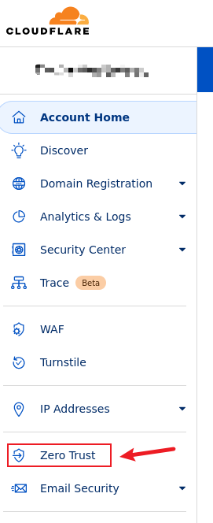

点击 `Networks` > `Tunnels` > `Add a tunnel` 功能

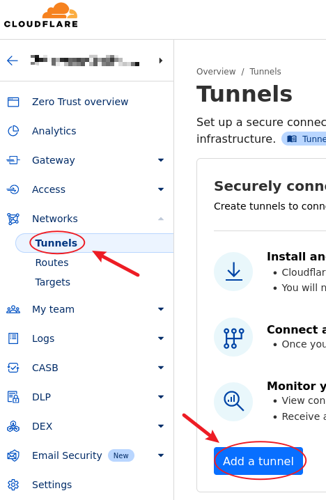

点击 `Select Cloudflared` 功能

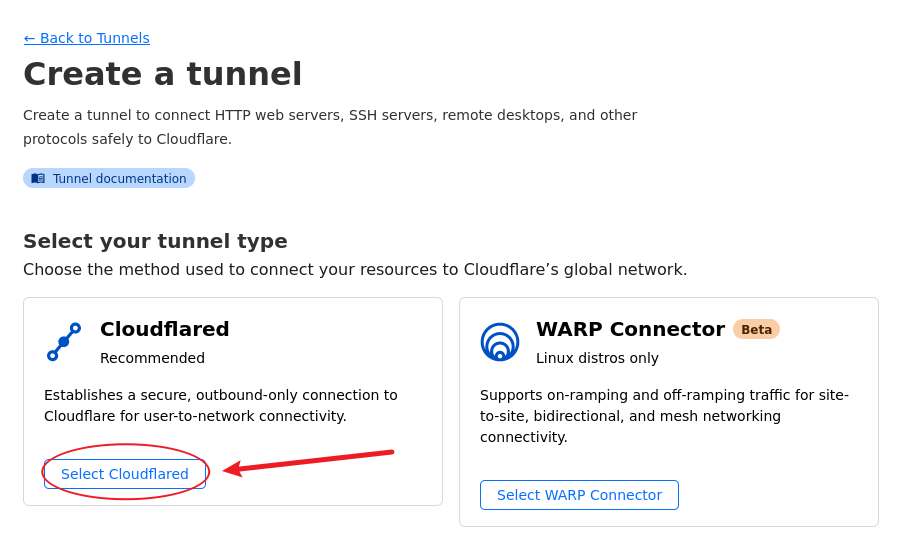

输入 tunnel 的名称，点击 `Save tunnel` 功能

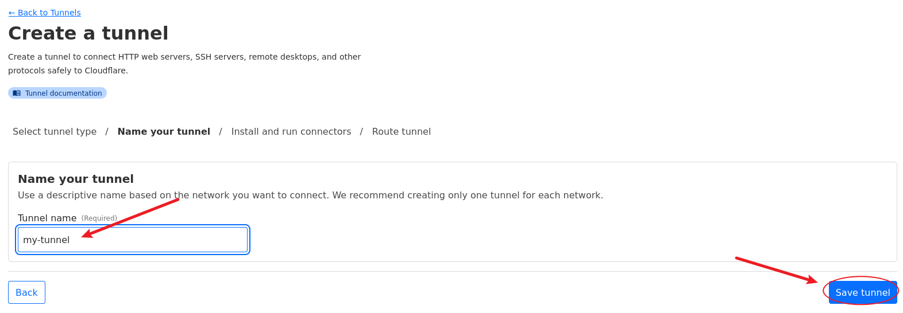

点击 `Docker` 使用 Docker 运行 cloudflared，点击 `复制` 按钮复制 `docker run ...` 命令，最后点击 `Next`

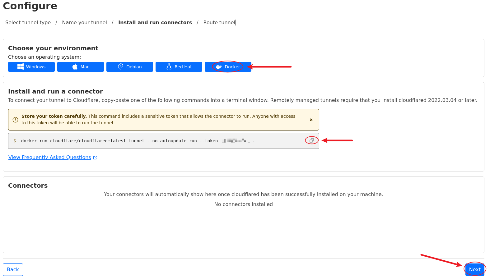

Subdomain 填写 `my-tunnel`，Domain 选择自定义的域名（例如：example.com），Service Type 选择 HTTP，Service URL 填写 `192.168.1.181:8080`（这是内网的 HTTP 服务），点击 `Save tunnel`

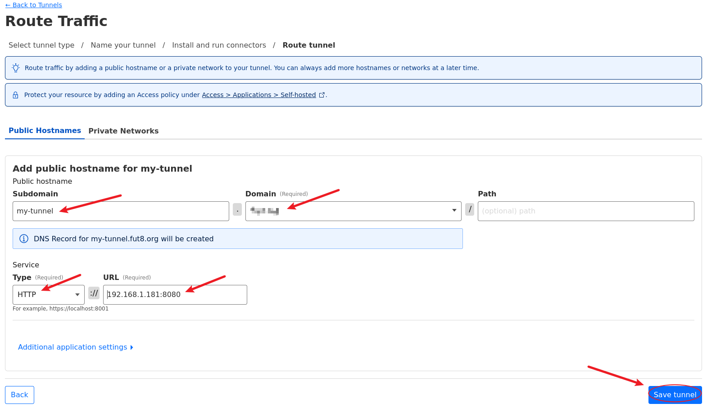

在内网中新建 CentOS8 并参考 <a href="/docker/docker的安装.html#使用-dcli-安装" target="_blank">链接</a> 安装 Docker，调整上面复制的 `docker run ...` 命令并在 CentOS8 中运行

```bash
docker run -d --restart unless-stopped cloudflare/cloudflared:latest tunnel --no-autoupdate run --token xxx
```

访问 `https://my-tunnel.example.com` 测试隧道是否正常。


#### 添加 Public Hostname

>提示：添加 Public Hostname 实质上是暴露一个内网服务。
>
>[参考链接](https://post.smzdm.com/p/admp85dn/)

转到 CloudFlare 首页点击左边导航栏中的 `Zero Trust` 菜单


点击 `Tunnels`，选中相应的隧道并点击 `Configure`

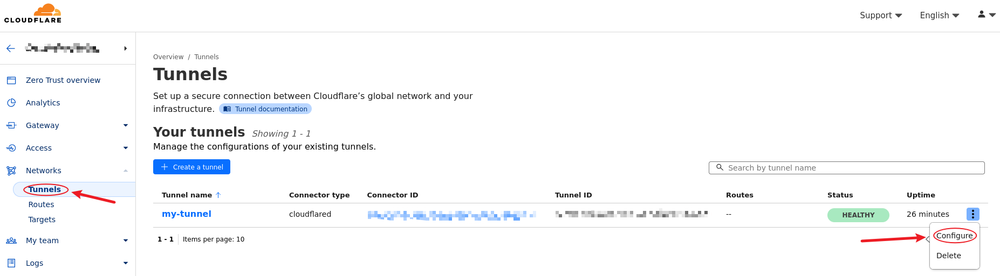

切换到 `Public Hostname` 标签页并点击 `Add a public hostname`

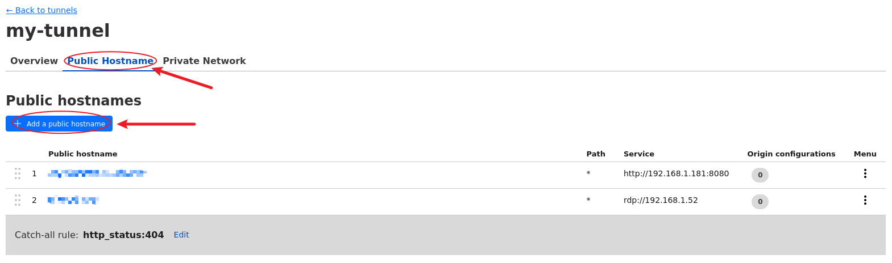

暴露位于 `192.168.1.181:8080` 的内网 HTTP 服务，Subdomain 填写 `web`，Domain 选择 example.com，稍后使用 `https://web.example.com` 访问 HTTP 服务。Service Type 选择 HTTP 表示 HTTP 服务，Service URL 填写 `192.168.1.181:8080` 表示内网服务所在的 IP+端口。点击 `Save hostname` 保存。

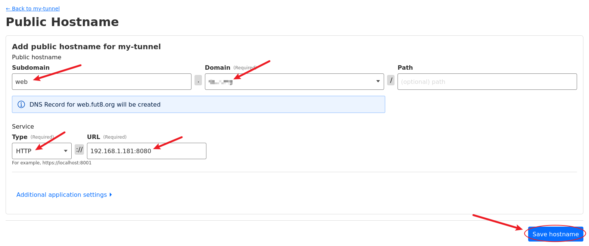

等待一段时间后，使用 `https://web.example.com` 访问 HTTP 服务成功。
