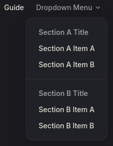
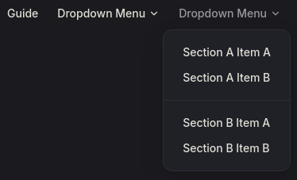
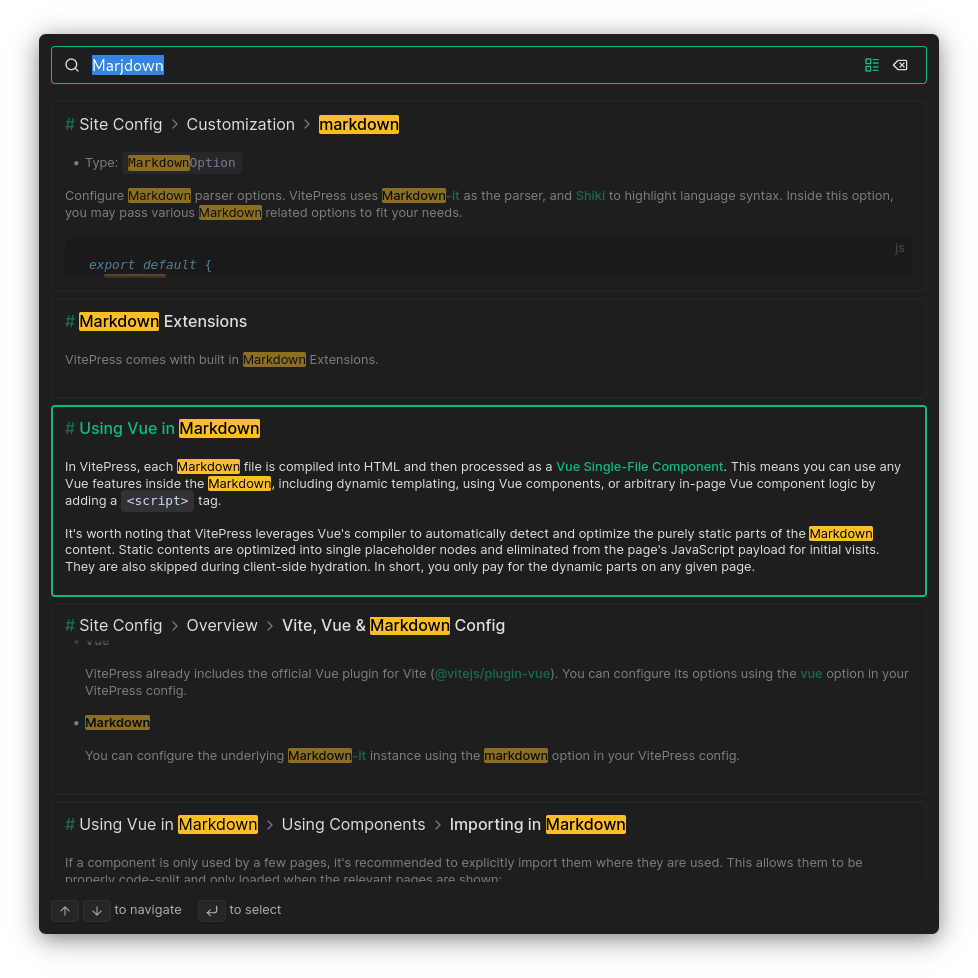

# VitePress

>[VitePress 官方网站](https://vitepress.dev)
>
>详细用法请参考本站 [示例](https://gitee.com/dexterleslie/demonstration/tree/master/demo-cms-system/demo-vitepress)


## 介绍

VitePress 是一个[静态站点生成器](https://en.wikipedia.org/wiki/Static_site_generator) (SSG)，专为构建快速、以内容为中心的站点而设计。简而言之，VitePress 获取用 Markdown 编写的内容，对其应用主题，并生成可以轻松部署到任何地方的静态 HTML 页面。


## 和 VuePress 区别

VitePress 灵感来源于 VuePress。最初的 VuePress 基于 Vue 2 和 webpack。借助 Vue 3 和 Vite，VitePress 提供了更好的开发体验、更好的生产性能、更精美的默认主题和更灵活的自定义 API。

VitePress 和 VuePress 之间的 API 区别主要在于主题和自定义。如果使用的是带有默认主题的 VuePress 1，迁移到 VitePress 应该相对简单。

VuePress 2 我们也投入了精力，它也支持 Vue 3 和 Vite，与 VuePress 1 的兼容性更好。但是，并行维护两个 SSG 是难以持续的，因此 Vue 团队决定将重点放在 VitePress，作为长期的主要 SSG 选择推荐。


## 创建项目

查看 node 版本

```bash
$ node --version
v20.12.2
```

创建一个空目录

```bash
mkdir test
cd test
```

为现有项目添加 vite 依赖

```bash
npm install -D vitepress --registry=https://registry.npmmirror.com
```

VitePress 附带一个命令行设置向导，可以帮助你构建一个基本项目。安装后，通过运行以下命令启动向导：

```bash
npx vitepress init
```

将需要回答几个简单的问题：

```
Need to install the following packages:
  vitepress@1.6.3
Ok to proceed? (y) y

┌  Welcome to VitePress!
│
◇  Where should VitePress initialize the config?
│  ./docs
│
◇  Site title:
│  My Awesome Project
│
◇  Site description:
│  A VitePress Site
│
◇  Theme:
│  Default Theme
│
◇  Use TypeScript for config and theme files?
│  Yes
│
◇  Add VitePress npm scripts to package.json?
│  Yes
│
└  Done! Now run npm run docs:dev and start writing.

```

启动项目

```bash
npm run docs:dev
```

访问 `http://localhost:5173/` 打开 VitePress。


## 导航栏

>[官方文档导航栏配置参考](https://vitepress.dev/zh/reference/default-theme-nav)

### 导航链接

可以定义 `themeConfig.nav` 选项以将链接添加到导航栏。

```json
export default {
  themeConfig: {
    nav: [
      { text: 'Guide', link: '/guide' },
      { text: 'Config', link: '/config' },
      { text: 'Changelog', link: 'https://github.com/...' }
    ]
  }
}
```

`text` 是 nav 中显示的实际文本，而 `link` 是单击文本时将导航到的链接。对于链接，将路径设置为不带 `.md` 后缀的实际文件，并且始终以 `/` 开头。

导航链接也可以是下拉菜单。为此，请替换 `link` 选项，设置 `items` 数组。

```json
export default {
  themeConfig: {
    nav: [
      { text: 'Guide', link: '/guide' },
      {
        text: 'Dropdown Menu',
        items: [
          { text: 'Item A', link: '/item-1' },
          { text: 'Item B', link: '/item-2' },
          { text: 'Item C', link: '/item-3' }
        ]
      }
    ]
  }
}
```

请注意，下拉菜单标题 (上例中的 `Dropdown Menu`) 不能具有 `link` 属性，因为它是打开下拉对话框的按钮。

还可以通过传入更多嵌套项来进一步向下拉菜单项添加“sections”。

```json
export default {
  themeConfig: {
    nav: [
      { text: 'Guide', link: '/guide' },
      {
        text: 'Dropdown Menu',
        items: [
          {
            // 该部分的标题
            text: 'Section A Title',
            items: [
              { text: 'Section A Item A', link: '...' },
              { text: 'Section A Item B', link: '...' }
            ]
          },
          {
            // 该部分的标题
            text: 'Section B Title',
            items: [
              { text: 'Section B Item A', link: '...' },
              { text: 'Section B Item B', link: '...' }
            ]
          }
        ]
      },
      {
        text: 'Dropdown Menu',
        items: [
          {
            // 也可以省略标题
            items: [
              { text: 'Section A Item A', link: '...' },
              { text: 'Section A Item B', link: '...' }
            ]
          },
          {
            // 也可以省略标题
            items: [
              { text: 'Section B Item A', link: '...' },
              { text: 'Section B Item B', link: '...' }
            ]
          }
        ]
      }
    ]
  }
}
```

“sections”下拉菜单效果如下：

- 有 `sections` 名



- 没有 `sections` 名




## 侧边栏

>[官方文档侧边栏配置参考](https://vitepress.dev/zh/reference/default-theme-sidebar)


### 全站侧边栏

>不管当前路由是什么，侧边栏都是相同的。

```json
export default {
  themeConfig: {
    sidebar: [
      {
        text: 'Guide',
        items: [
          { text: 'Introduction', link: '/introduction' },
          { text: 'Getting Started', link: '/getting-started' },
        ]
      }
    ]
  }
}
```


### 带“部分”的侧边栏

>用”部分“区分不同区域的侧边栏

```json
export default {
  themeConfig: {
    sidebar: [
      {
        text: 'Section Title A',
        items: [
          { text: 'Item A', link: '/item-a' },
          { text: 'Item B', link: '/item-b' },
        ]
      },
      {
        text: 'Section Title B',
        items: [
          { text: 'Item C', link: '/item-c' },
          { text: 'Item D', link: '/item-d' },
        ]
      }
    ]
  }
}
```


### 多级嵌入侧边栏

```json
export default {
  themeConfig: {
    sidebar: [
      {
        text: 'Level 1',
        items: [
          {
            text: 'Level 2',
            items: [
              {
                text: 'Level 3',
                items: [
                    {
                        text: 'Level 4-1',
                        link: 'l4-1'
                    },{
                        text: 'Level 4-2',
                        link: 'l4-2'
                    }
                ]
              }
            ]
          }
        ]
      }
    ]
  }
}
```


### 多侧边栏

可能会根据页面路径显示不同的侧边栏。例如，如本站点所示，可能希望在文档中创建单独的侧边栏，例如“指南”页面和“配置参考”页面。

为此，首先将你的页面组织到每个所需部分的目录中：

```
.
├─ guide/
│  ├─ index.md
│  ├─ one.md
│  └─ two.md
└─ config/
   ├─ index.md
   ├─ three.md
   └─ four.md
```

然后，更新配置以定义每个部分的侧边栏。这一次，应该传递一个对象而不是数组。

```json
export default {
  themeConfig: {
    sidebar: {
      // 当用户位于 `guide` 目录时，会显示此侧边栏
      '/guide/': [
        {
          text: 'Guide',
          items: [
            { text: 'Index', link: '/guide/' },
            { text: 'One', link: '/guide/one' },
            { text: 'Two', link: '/guide/two' }
          ]
        }
      ],

      // 当用户位于 `config` 目录时，会显示此侧边栏
      '/config/': [
        {
          text: 'Config',
          items: [
            { text: 'Index', link: '/config/' },
            { text: 'Three', link: '/config/three' },
            { text: 'Four', link: '/config/four' }
          ]
        }
      ]
    }
  }
}
```


## link 结尾带"/"和不带"/"区别

每个 `link` 都应指定以 `/` 开头的实际文件的路径。如果在链接末尾添加斜杠，它将显示相应目录的 `index.md`。

```json
export default {
  themeConfig: {
    sidebar: [
      {
        text: 'Guide',
        items: [
          // 显示的是 `/guide/index.md` 页面
          { text: 'Introduction', link: '/guide/' }
        ]
      }
    ]
  }
}
```


## aside 容器

>[CSDN aside 容器设置参考](https://blog.csdn.net/delete_you/article/details/129938705)

```json
export default defineConfig({
  themeConfig: {
    // aside，设定为false将关闭右侧栏，文档内容会填充剩余空白部分
    aside: true,
    // outline设置为deep可以解析2-6层深度的标题嵌套
    outline: "deep",
    // 设置所有aside的标题
    outlineTitle: "页面导航",
  }
})

```


## 启用搜索功能

>[参考链接](https://vitepress.dev/reference/default-theme-search)

借助 minisearch，VitePress 支持使用浏览器内索引进行模糊全文搜索。要启用此功能，只需在 .vitepress/config.ts 文件中将 themeConfig.search.provider 选项设置为“local”：

```javascript
import { defineConfig } from 'vitepress'

export default defineConfig({
  themeConfig: {
    search: {
      provider: 'local'
    }
  }
})
```

示例结果：


