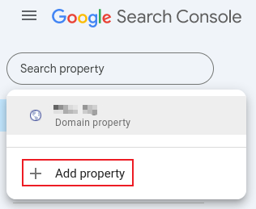
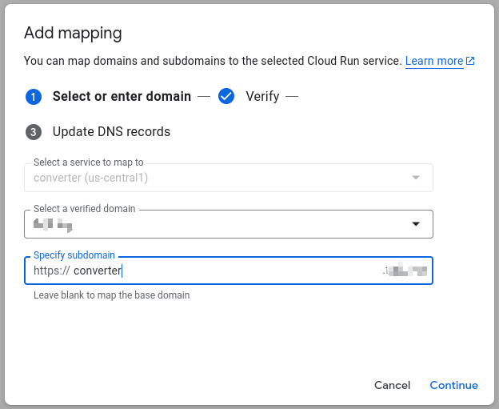

# Google Cloud Platform


## cloud source repository

> 参考 source-repository
> https://cloud.google.com/source-repositories/docs


## 启用api

> 参考 enable-service
>
> https://console.cloud.google.com/apis/library/sourcerepo.googleapis.com

## 调试 gcp 防火墙

### 前言

在使用 gcp 防火墙的来源 ip CIDR 过滤特性做源站保护时，可能会因为第三方的 cdn 节点的 CIDR 变动并且未更新到 gcp 防火墙中而导致错误拦截此类 cdn 节点。此时需要调试 gcp 防火墙并找出被拦截 cdn 节点所属的 CIDR。

### 方法

1、手动创建名为 deny-logging-debug 的 gcp 防火墙规则，拦截行为设置为 “拒绝”，来源 ip 地址 CIDR 为所有 ipv4 地址 0.0.0.0/0，优先级别为 65535（gcp 防火墙最低优先级别，为了让这条规则在所有其他规则后执行），打开防火墙日志记录功能。

2、绑定次 gcp 防火墙规则到虚拟机中。

3、通过点击防火墙规则中查看日志功能导航到日志查询分析功能中，此时点击 “清除所有过滤” 按钮，再点击查询按钮不断地加载最新日志以查看是否有显示状态为 "DENIDED" 的日志。

4、如果发现有状态为 ”DENIDED“ 的日志，此时展开此日志并查看来源的 ip 地址后，把次 ip 地址添加到对应放行的防火墙规则中。


## Google Search Console

### 介绍

Google Search Console（简称GSC）是Google提供的一项免费数据服务，也被称为谷歌站长工具或谷歌搜索控制台。它主要帮助站长、开发者和营销人员监控、维护并优化其网站在Google搜索结果中的展示情况。

以下是Google Search Console的主要功能和用途：

1. **性能报告**：提供详细的点击量、展示次数、点击率（CTR）和平均排名数据，帮助用户了解用户如何通过Google搜索找到网站的内容，以及网站在搜索结果中的表现情况。
2. **覆盖范围报告**：识别网站的索引问题，例如抓取错误、已索引但存在问题的页面，以及哪些页面被成功索引。这有助于用户发现并解决网站的索引编制问题。
3. **移动设备可用性**：确保网站在移动设备上的用户体验没有问题，例如是否存在可点击元素过近或内容超出屏幕的问题。这有助于提升网站在移动设备上的搜索表现。
4. **链接分析**：查看哪些网站链接到了用户的内容，以及用户网站内页之间的链接结构。这有助于用户了解网站的外部链接情况，并优化网站的链接结构。
5. **URL检查工具**：分析特定页面的索引状态，查看Google如何抓取和渲染该页面。这有助于用户了解Google对网站页面的抓取和索引情况。
6. **问题提醒**：在Google遇到与用户网站相关的索引编制、垃圾内容或其他问题时，GSC会向用户发送提醒。这有助于用户及时发现并解决网站的问题。

此外，Google Search Console还提供了丰富的数据分析和优化建议，帮助用户找到提升排名和用户体验的方法。通过GSC，用户可以更全面地了解网站在Google搜索结果中的表现情况，并采取相应的优化措施。

要使用Google Search Console，用户需要首先验证网站所有权，并添加网站资源。然后，用户可以提交XML站点地图，以帮助Google更快地抓取和索引网站内容。接下来，用户可以定期查看性能和覆盖范围报告，及时修复问题页面，并关注核心网络指标（Core Web Vitals）以优化页面加载速度、交互性和视觉稳定性。

总之，Google Search Console是优化网站搜索表现的强大工具，通过利用其提供的详细数据和实用功能，用户可以提高网站在搜索引擎中的可见性，改善用户体验，并推动业务发展。


### 使用 GSC 添加自定义域名

>提醒：使用 GSC 添加自定义域名到 GGP 后，Google Cloud Run 相关产品即可能够引用该自定义域名。

登录 [GSC 控制台](https://search.google.com/search-console)

点击 `Add property` 添加自定义域名

在弹出窗口 `Select property type` 的 `Domain` 区域输入自定义域名 `my.example.com`，然后点击 `CONTINUE` 按钮

授权 GSC 在 CloudFlare 自定义域名下添加一条 `TXT` 记录类型以验证用户是自定义域名的属主

一旦验证通过后，自定义域名会作为域名资产被添加到 GSC 控制台中。


## Artifact Registry


### 介绍

Artifact Registry 提供用于管理私有软件包和 Docker 容器映像的单个位置。

私有软件包包括：

- Go 模块
- Helm 图表
- Java 软件包
- Node.js 软件包
- Python 软件包
- Apt 软件包
- RPM 软件包


### 创建标准 Docker 制品库

>[官方参考链接](https://cloud.google.com/artifact-registry/docs/docker/store-docker-container-images?hl=zh-cn#gcloud)

*标准制品库*是您的私有工件的代码库。您可以将工件上传到这些代码库，也可以直接从这些代码库下载工件。

[启用 Artifact Registry API](https://cloud.google.com/artifact-registry/docs/enable-service?hl=zh-cn#console)

使用 Google Cloud 控制台创建代码库

1. 打开 Google Cloud 控制台中的 [制品库](https://console.cloud.google.com/artifacts) 页面。

2. 点击**创建代码库**。

3. 指定代码库名称。对于项目中的每个代码库位置，代码库名称不得重复。例如：future 项目使用 future 作为代码库名称。

4. 选择代码库格式 Docker。

5. 如果有多个代码库模式可用，请选择**标准**。

6. 在**位置类型**下，选择代码库的位置：

   - 选择位置类型：区域。
   - 在**区域**列表中，选择 us-central1 (爱荷华) 。

7. 为代码库添加说明。说明有助于确定代码库的用途以及其包含的工件类型。

8. 如果您想使用清理政策删除未使用的工件，请在**清理政策**部分中执行以下操作：

   - 选择**试运行**，在应用政策之前对其进行测试。

   - 点击**添加政策**，将保留或删除政策添加到代码库

   - 在**名称**字段中为清理政策指定一个描述性名称。

   - 在**政策类型**部分，选择以下选项之一：

     - **按条件删除**：根据您定义的条件删除工件。

     - **按条件保留**：根据您定义的条件保留工件。

     - **保留最新版本**：为每个软件包保留一定数量的最新版本。

       >**注意** ：如果您为此政策设置了**软件包前缀**，则系统只会保留与软件包前缀匹配的工件，数量不超过为最新版本设置的数量。

   如需详细了解清理政策，请参阅[配置清理政策](https://cloud.google.com/artifact-registry/docs/repositories/cleanup-policy?hl=zh-cn)。

   这里不设置清理政策，选择 `试运行` 方式，需要手动删除。

9. 在 **Artifact Analysis** 部分，选择漏洞扫描设置：

   - **已启用** - 允许在此代码库中进行扫描。您必须为项目启用 Container Scanning API。

     当您启用 Container Scanning API 后，系统会立即开始计费。在项目上启用 Container Scanning API 后，系统会为所有新仓库和现有仓库启用漏洞扫描功能。当您将映像推送到 Artifact Registry 时，Artifact Analysis 会自动对其进行扫描。

   - **已停用** - 阻止在此代码库中进行扫描。如果您的项目启用了 Container Scanning API，则系统会继续扫描其他仓库；此仓库将被排除。

   如需详细了解漏洞扫描选项，请参阅[启用和停用自动扫描](https://cloud.google.com/artifact-analysis/docs/enable-automatic-scanning?hl=zh-cn)。

   这里选择 `停用`。

10. 点击**创建**。


### 上传阿里云镜像到制品库中

登录 [谷歌控制台](https://console.cloud.google.com/welcome?hl=zh-cn)，打开右上角 `激活 Cloud Shell` 图标 

在 Cloud Shell 中：

- 登录阿里云镜像仓库

  ```bash
  docker login registry.cn-hangzhou.aliyuncs.com
  ```

- 拉取阿里云镜像

  ```bash
  docker pull registry.cn-hangzhou.aliyuncs.com/future-private/converter
  ```

- 为阿里云镜像打标签并指向新的制品库

  ```bash
  docker tag registry.cn-hangzhou.aliyuncs.com/future-private/converter us-central1-docker.pkg.dev/[project-id]/future/converter
  ```

- 推送镜像到新的制品库中

  ```bash
  docker push us-central1-docker.pkg.dev/[project-id]/future/converter
  ```

- 查看 [制品库列表](https://console.cloud.google.com/artifacts?hl=zh-cn) 即可看到刚刚推送的 future 制品


## Cloud Run

>[Cloud Run 是什么](https://cloud.google.com/run/docs/overview/what-is-cloud-run?hl=zh-cn)


### 介绍

Cloud Run 是一个托管式计算平台，可让您直接在 Google 可伸缩的基础架构之上运行容器。

如果您可以构建使用任何编程语言编写的代码的容器映像，则可以在 Cloud Run 上部署该代码。实际上，构建容器映像是可选操作。如果您使用的是 Go、Node.js、Python、Java、.NET Core、Ruby 或支持的框架，则可以使用[基于来源的部署](https://cloud.google.com/run/docs/deploying-source-code?hl=zh-cn)选项，它会按照您所用语言的最佳实践构建容器。

Google 构建了可与 Google Cloud上的其他服务完美搭配使用的 Cloud Run，以便您可以构建功能齐全的应用。

简而言之，Cloud Run 可让开发者将时间花在编写代码上，将很少的时间花在运行、配置和伸缩 Cloud Run 服务上。您无需创建集群或管理基础架构即可高效使用 Cloud Run。


### 服务和作业：运行代码的两种方式

在 Cloud Run 上，代码可以作为服务或作为*作业*连续运行。服务和作业都是在同一环境中运行，并且可以使用与 Google Cloud上的其他服务相同的集成。

- **Cloud Run 服务**。用于运行响应 Web 请求、事件或函数的代码。
- **Cloud Run 作业**。用于运行执行操作（作业）并在操作完成时退出的代码。


### 将容器映像部署到 Cloud Run

>[官方参考链接](https://cloud.google.com/run/docs/deploying)

<a href="/gcp/README.html#上传阿里云镜像到制品库中" target="_blank">上传镜像到标准制品库中</a>

使用控制台部署容器映像，请执行以下操作：

1. 在 Google Cloud 控制台中，转到 [Cloud Run](https://console.cloud.google.com/run) 页面。

2. 点击**部署容器**，然后选择**服务**，以显示“创建服务”表单。

   - 在该表单中选择部署选项：

     - 如果您要手动部署容器，请选择**从现有容器映像部署一个修订版本**并指定容器映像。
     - 如果要自动进行持续部署，请选择“从源代码库中持续部署新修订版本”并按照[持续部署的说明](https://cloud.google.com/run/docs/continuous-deployment-with-cloud-build?hl=zh-cn#setup-cd)进行操作。

     这里选择 `从现有容器映像部署一个修订版本并指定容器映像`，点击 `选择` 功能弹出 `选择容器映像 ` 对话框根据提示选择以上步骤中上传到标准制品库中的镜像即可。

   - 输入所需的服务名称。服务名称不得超过 49 个字符，并且在每个区域和项目中必须是唯一的。服务名称一旦指定便无法更改，并且公开显示。

   - 选择您想要使用的服务[区域](https://cloud.google.com/run/docs/deploying?hl=zh-cn#before-you-begin)。 区域选择器会显示[价格层级](https://cloud.google.com/run/pricing?hl=zh-cn)、[网域映射](https://cloud.google.com/run/docs/mapping-custom-domains?hl=zh-cn)的可用性，并突出显示[碳影响最低](https://cloud.google.com/sustainability/region-carbon?hl=zh-cn#region-picker)的区域。这里选择 us-central1  (爱荷华)  

   - 根据需要设置[结算](https://cloud.google.com/run/docs/configuring/billing-settings?hl=zh-cn)。这里选择 `基于请求（仅在处理请求时才会收费。如果没有请求，CPU 会受到限制。）`

   - 在**服务扩缩**下，如果您使用默认的 Cloud Run [自动扩缩](https://cloud.google.com/run/docs/about-instance-autoscaling?hl=zh-cn)，请视情况指定[实例数下限](https://cloud.google.com/run/docs/configuring/min-instances?hl=zh-cn)。如果您使用[手动扩缩](https://cloud.google.com/run/docs/configuring/services/manual-scaling?hl=zh-cn)，请为服务指定实例数。这里选择 `自动扩缩`，`实例数下线` 设置为 `0`

   - 根据需要设定表单中的 [*Ingress*](https://cloud.google.com/run/docs/securing/ingress?hl=zh-cn) 设置。这里选择 `全部（允许直接从互联网访问您的服务）`。

   - 在“身份验证”下，配置以下内容：

     - 如果您要创建公共 API 或网站，请选择**允许未通过身份验证的调用**。选中此复选框后，系统会将 IAM Invoker 角色分配给特殊标识符 `allUser`。您可以在创建服务后[使用 IAM 修改此设置](https://cloud.google.com/run/docs/securing/authenticating?hl=zh-cn#service-to-service)。
     - 如果您需要通过身份验证加以保护的安全服务，请选择**需要身份验证**。

     这里选择 `允许未通过身份验证的调用`。

   - 点击**容器、卷、网络、安全性**以在相应的标签页中设置其他可选设置：

     - 并发
     - 容器配置
     - CPU 上限
     - 内存限制
     - 请求超时
     - 密文
     - 环境变量
     - 执行环境
     - HTTP/2
     - 服务帐号
     - Cloud SQL 连接
     - VPC 连接

3. 完成服务配置后，请点击**创建**以将映像部署到 Cloud Run，然后等待部署完成。

4. 点击显示的网址链接，以打开已部署服务的唯一、稳定的端点。访问端点以测试服务（国内能够访问端点，例如： `https://converter-xxx.us-central1.run.app`）。


### 为 Cloud Run 添加自定义域名

>[参考链接](https://cloud.google.com/run/docs/mapping-custom-domains?hl=zh-cn#run)

<a href="/gcp/README.html#使用-gsc-添加自定义域名" target="_blank">使用 GSC 添加自定义域名</a>

转到 Cloud Run [自定义域名管理功能](https://console.cloud.google.com/run/domains)，点击 `Add mapping` 功能

选择已通过 GSC 验证并添加的自定义域名，填写子域名后点击 `Continue` 按钮，如图：

在 CloudFlare 域名中添加 CNAME 类型的 DNS 记录：

- Type 为 CNAME
- Name 为 converter（和 Cloud Run 中子域名对应）
- Content 为 xxx.googlehosted.com（Cloud Run 分配的）
- Proxied 为打开状态

等待到自定义域名成功添加到 Cloud Run 后

通过 `https://converter.example.com/api/v1/converter/wordToPdf` 测试自定义域名是否配置成功（注意：不能成功通过自定义域名访问服务，因为 Cloud Run 返回 302 重定向给 CloudFlare，请参考下面步骤解决此问题）。

CloudFlare 没有使用 HTTPS 和 Cloud Run 通讯，所以导致 Cloud Run 返回 302 重定向代码，此问题的参考 [链接](https://stackoverflow.com/questions/57700973/getting-302-redirects-on-any-service-that-i-redeploy)，通过参考本站 <a href="/cloudflare/README.html#加密模式" target="_blank">链接</a> 配置域名启动 Full 的加密模式即可解决此问题。


