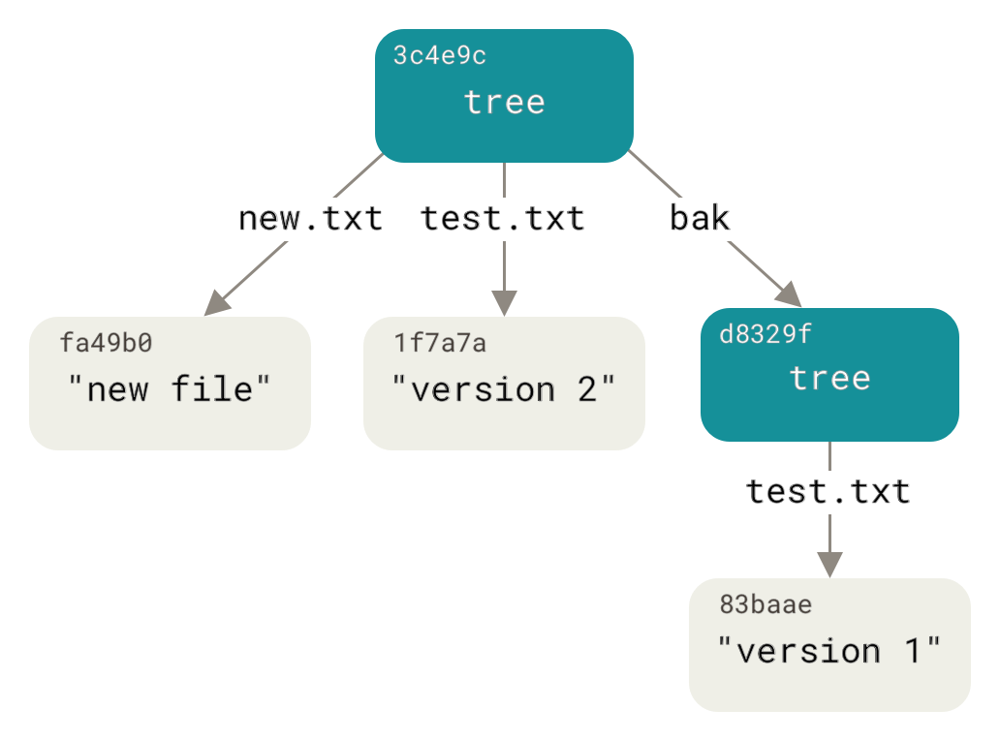

# 原理


## `git`数据结构

>`https://git-scm.com/book/en/v2/Git-Internals-Git-Objects`

初始化新的`git`仓库

```bash
git init demo-temp-git
```


### `git objects（blob类型）`

>`blob`类型只存储对象的内容，不存储对象的元数据信息，例如：文件名称、文件权限等。

创建新的`blob`对象并存储到对象数据库中

```bash
echo 'test content' | git hash-object -w --stdin
```

新的`blob`对象被存储到`.git/objects/d6/70460b4b4aece5915caf5c68d12f560a9fe3e4`中，内容使用`zlib`算法压缩并存储。注意：只保存文件内容，不保存文件的元数据，例如：文件名、权限等

```bash
find .git/objects -type f
```

打印`blob`对象内容

```bash
git cat-file -p d670460b4b4aece5915caf5c68d12f560a9fe3e4
```

模拟对文件的版本控制过程

- 创建一个新文件

  ```bash
  echo 'version 1' > test.txt
  git hash-object -w test.txt
  ```

- 对同一个文件写入新内容

  ```bash
  echo 'version 2' > test.txt
  git hash-object -w test.txt
  ```

- 对象数据库会保护两个版本的数据

  ```bash
  find .git/objects -type f
  ```

- 删除`test.txt`文件，从对象数据库中分别获取版本`1`和版本`2`

  ```bash
  rm -f test.txt
  
  # 获取版本1
  git cat-file -p 83baae61804e65cc73a7201a7252750c76066a30 > test.txt
  
  # 获取版本2
  git cat-file -p 1f7a7a472abf3dd9643fd615f6da379c4acb3e3a > test.txt
  ```

获取`hash`值对应的对象类型

```bash
git cat-file -t 1f7a7a472abf3dd9643fd615f6da379c4acb3e3a
```


### `tree objects`

>我们将要研究的下一种 Git 对象是树，它解决了存储文件名的问题，还允许您将一组文件存储在一起。Git 以类似于 UNIX 文件系统的方式存储内容，但略微简化。所有内容都存储为树和 blob 对象，树对应于 UNIX 目录条目，而 blob 或多或少对应于 inode 或文件内容。单个树对象包含一个或多个条目，每个条目都是 blob 或子树及其相关模式、类型和文件名的 SHA-1 哈希。

您可以相当轻松地创建自己的树。Git 通常通过获取暂存区或索引的状态并从中写入一系列树对象来创建树。因此，要创建树对象，您首先必须通过暂存一些文件来设置索引。要创建具有单个条目（test.txt 文件的第一个版本）的索引，您可以使用管道命令 git update-index。使用此命令可以人为地将 test.txt 文件的早期版本添加到新的暂存区。您必须向其传递 --add 选项，因为该文件尚不存在于暂存区中（您甚至尚未设置暂存区），并传递 --cacheinfo，因为您要添加的文件不在您的目录中，但在您的数据库中。然后，指定模式、SHA-1 和文件名：

```bash
git update-index --add --cacheinfo 100644 83baae61804e65cc73a7201a7252750c76066a30 test.txt
```

在本例中，您指定的模式为 100644，表示它是一个普通文件。其他选项包括 100755，表示它是一个可执行文件；以及 120000，指定一个符号链接。该模式取自普通的 UNIX 模式，但灵活性要差得多 — 这三种模式是唯一对 Git 中的文件 (blob) 有效的模式（尽管其他模式用于目录和子模块）。

现在，您可以使用 git write-tree 将暂存区写入树对象。不需要 -w 选项 — 如果该树尚不存在，则调用此命令会自动从索引状态创建一个树对象：

```bash
git write-tree

# 获取对象类型
git cat-file -t d8329fc1cc938780ffdd9f94e0d364e0ea74f579

# 显示tree对象内容
git cat-file -p d8329fc1cc938780ffdd9f94e0d364e0ea74f579
```

现在您将使用 test.txt 的第二个版本创建一个新树以及一个新文件：

```bash
echo 'new file' > new.txt

git update-index --cacheinfo 100644 1f7a7a472abf3dd9643fd615f6da379c4acb3e3a test.txt

git update-index --add new.txt
```

您的暂存区现在有了新版本的 test.txt 以及新文件 new.txt。写出该树（将暂存区或索引的状态记录到树对象中）并查看它是什么样子：

```bash
git write-tree

git cat-file -p 0155eb4229851634a0f03eb265b69f5a2d56f341
```

请注意，这棵树既有文件条目，又有 test.txt SHA-1 是之前的“版本 2”SHA-1（1f7a7a）。为了好玩，您将把第一棵树作为子目录添加到这个目录中。您可以通过调用 git read-tree 将树读入暂存区。在这种情况下，您可以使用 --prefix 选项将现有树作为子树读入暂存区：

```bash
git read-tree --prefix=bak d8329fc1cc938780ffdd9f94e0d364e0ea74f579

git write-tree

git cat-file -p 3c4e9cd789d88d8d89c1073707c3585e41b0e614
```

如果你从刚刚编写的新树中创建了一个工作目录，那么你将获得工作目录顶层的两个文件和一个名为 bak 的子目录，其中包含 test.txt 文件的第一个版本。你可以将 Git 包含的这些结构的数据想象成这样：




### `commit objects`

如果您已完成上述所有操作，那么您现在有三棵树，它们代表您想要跟踪的项目的不同快照，但之前的问题仍然存在：您必须记住所有三个 SHA-1 值才能调用快照。您也不知道谁保存了快照、何时保存或为什么保存。这是提交对象为您存储的基本信息。

要创建提交对象，请调用 commit-tree 并指定单个树 SHA-1 以及哪些提交对象（如果有）直接位于它之前。从您编写的第一棵树开始：

```bash
echo 'First commit' | git commit-tree d8329f
```

现在你可以用 git cat-file 查看新的提交对象：

```bash
git cat-file -p <上一个commit的hash值>
```

提交对象的格式很简单：它指定了当时项目快照的顶层树；父提交（如果有）（上面描述的提交对象没有任何父提交）；作者/提交者信息（使用您的 user.name 和 user.email 配置设置和时间戳）；一个空白行，然后是提交消息。

接下来，您将编写另外两个提交对象，每个对象都引用紧接在它之前的提交：

```bash
echo 'Second commit' | git commit-tree 0155eb -p <上一个commit的hash值>

echo 'Third commit'  | git commit-tree 3c4e9c -p <上一个commit的hash值>
```

这三个提交对象分别指向您创建的三个快照树之一。奇怪的是，如果您在最后一次提交 SHA-1 上运行 git log 命令，那么您现在有一个真正的 Git 历史记录，可以使用该命令查看它：

```bash
git log --stat <上一个commit的hash值>
```

太棒了。您刚刚完成了构建 Git 历史记录的低级操作，而无需使用任何前端命令。这基本上就是您运行 git add 和 git commit 命令时 Git 所做的工作 - 它存储已更改文件的 blob、更新索引、写出树并写入引用顶级树和紧接在它们之前的提交的提交对象。这三个主要 Git 对象 - blob、树和提交 - 最初作为单独的文件存储在您的 .git/objects 目录中。以下是示例目录中现在的所有对象，并注释了它们存储的内容：

```bash
$ find .git/objects -type f
```

如果你遵循所有内部指针，你会得到类似这样的对象图：

