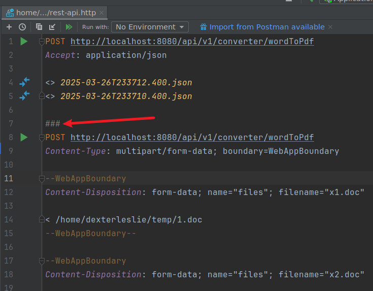
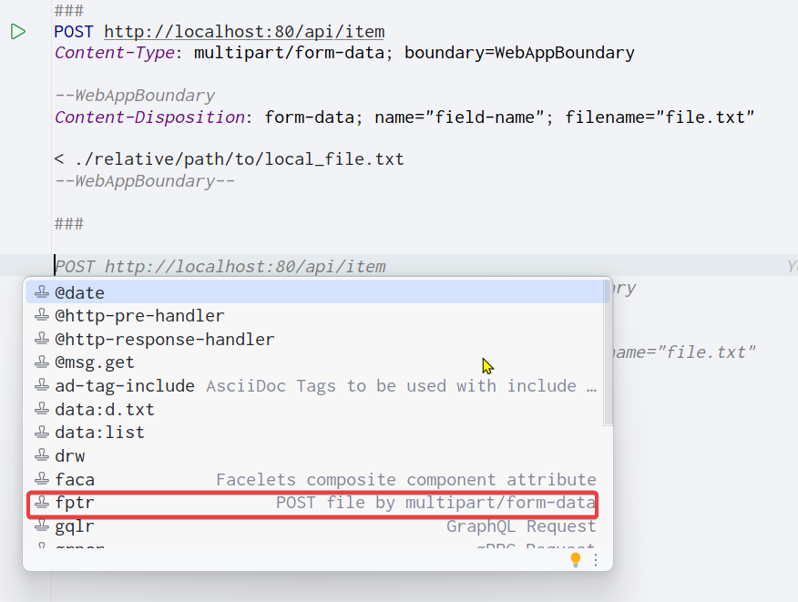

# IDEA


## 远程开发

> 下载 idea2021 之后的版本才有这个特性。

```shell
# 当前测试的idea版本为2022.3.3

# centOS8设置: 上传代码目录路径为 /root/workspace-git/ecommerce-all
# centOS8设置: 安装git命令，yum install git -y
# centOS8设置: 使用dcli程序安装docker、maven

# idea设置: 在idea中根据提示新建remote development信息，NOTE: 选择project directory为/root/workspace-git/ecommerce-all/ecommerce-parent，点击确认后需要等待idea下载相关组件并自动配置remote development环境
# idea设置: 使用Project Structure设置工程jdk目录
# idea设置: 使用Settings设置maven home centOS8的maven路径
# idea设置: 显示Git Commit tab，打开Settings>Version Control>Commit>Use non-modal commit interface
```


## 设置 multiple rows 显示 tabs

打开 Settings 搜索 “tabs row”，然后勾选 “multiple rows”。

或者 Editor > General > Editor Tabs > Show tabs in > Multiple rows


## Scratches 目录

IntelliJ IDEA 的 Scratches 目录是一个专门用于存储临时代码片段的区域。这个目录对于开发者来说非常有用，因为它允许开发者在不干扰当前项目文件的情况下，快速测试或记录一些临时的逻辑或代码。以下是对 IDEA Scratches 目录的详细解释：

### Scratches 目录的特点

1. 临时存储：
   - Scratches 目录中的文件是临时的，通常不用于长期存储或版本控制。
   - 这些文件不会与项目文件混淆，因为它们存储在专门的位置。
2. 跨项目访问：
   - 在 Scratches 目录中创建的文件可以在不同的项目之间访问。
   - 这意味着开发者可以在一个项目中创建临时文件，然后在另一个项目中继续编辑或使用它。
3. 支持多种语言：
   - Scratches 目录支持多种编程语言，包括 Java、Kotlin、Groovy 等。
   - 开发者可以使用这些语言编写和测试代码片段。
4. 可运行和调试：
   - Scratches 目录中的代码片段是可运行和可调试的。
   - 开发者可以点击左边栏的图标来运行或调试代码片段。

### 如何使用 Scratches 目录

1. 创建 Scratches 文件：
   - 可以通过文件菜单创建 Scratches 文件：File - New - Scratch File。
   - 也可以使用快捷键 Ctrl+Alt+Shift+Insert 来创建。
2. 管理 Scratches 文件：
   - Scratches 文件存储在 IDEA 的专门目录下，通常是在用户的配置目录中。
   - 开发者可以通过 IDEA 的设置或配置来查看和更改 Scratches 目录的位置。
3. 编辑和运行 Scratches 文件：
   - 可以在 Scratches 文件中编写代码，并使用 IDEA 的代码补全、语法高亮等功能。
   - 点击左边栏的图标来运行或调试代码片段。

### 注意事项

- **本地存储**：Scratches 目录中的文件是本地存储的，不适用于多人协作。
- **自动保存**：虽然 IDEA 通常会自动保存项目文件，但 Scratches 目录的自动保存行为可能因配置而异。为了确保不会丢失重要的临时代码，建议定期手动保存或使用版本控制系统来备份。
- **性能考虑**：由于 Scratches 目录中的文件是临时的，因此它们可能会对 IDEA 的性能产生一定影响。如果存储了大量的临时文件，可能会导致 IDEA 启动速度变慢或占用更多的内存。因此，建议定期清理不再需要的临时文件。

综上所述，IDEA 的 Scratches 目录是一个功能强大且灵活的工具，可以帮助开发者更好地管理和测试临时代码片段。通过合理使用 Scratches 目录，开发者可以提高开发效率并减少不必要的干扰。


## HTTP Client

### 介绍

IDEA HTTP Client是IntelliJ IDEA自带的一款简洁轻量级的接口调用插件，以下是对其的详细介绍：

一、功能概述

通过IDEA HTTP Client，用户可以在IDEA上开发、调试和测试RESTful Web服务。它提供了一个简单直观的HTTP请求编辑器，支持多种HTTP方法（如GET、POST、PUT、PATCH等），并允许用户配置请求头、请求体、代理、SSL证书等参数。此外，IDEA HTTP Client还支持保存常用请求模板、查看历史记录、导出请求为Curl或Postman格式等功能。

二、使用指南

1. **插件安装与启动**：
   - IDEA HTTP Client插件通常默认已安装启动。若未安装，可通过“File”-“Settings”-“Plugins”路径进行安装。
2. **创建请求文件**：
   - 在项目根目录下创建一个存储请求文件的文件夹。
   - 在文件夹中创建HTTP Client请求文件。
3. **添加请求**：
   - 打开创建的文件，点击右上角工具栏中的“add request”，选择相应的请求类型（如GET、POST等）。
   - 在请求编辑器中输入请求的URL、HTTP方法、请求头和请求体等信息。
4. **发送请求**：
   - 点击左边的运行按钮或按下快捷键（如“Alt+F12”）发送请求。
   - IDEA将显示响应结果，包括响应状态、响应头和响应体等信息。

三、请求示例

1. **GET请求示例**：
   - GET请求可以包含请求头、参数、环境变量等。
   - 示例：`GET https://httpbin.org/ip Accept: application/json`
2. **POST请求示例**：
   - POST请求可以包含JSON格式的请求体、表单字段和文件等。
   - 示例：`POST https://httpbin.org/post Content-Type:application/json { "id": 999, "value": "content" }`
3. **PUT/PATCH请求示例**：
   - PUT和PATCH请求通常用于更新资源。
   - 示例：`PUT http://localhost:8080/person/put Content-Type:application/json { "name": "name111", "age": 17 }`
4. **带鉴权验证的请求示例**：
   - IDEA HTTP Client支持Basic、Digest和Token等多种鉴权方式。
   - 示例：`GET https://httpbin.org/basic-auth/user/passwd Authorization: Basic user passwd`

四、高级功能

1. **动态变量**：
   - IDEA HTTP Client支持在请求中使用动态变量，如UUID、时间戳等。
   - 示例：`GET http://httpbin.org/anything?id={{$uuid}}&ts={{$timestamp}}`
2. **断言**：
   - 用户可以在请求中添加断言来验证响应结果是否符合预期。
3. **集成调试器**：
   - 发送请求时可以集成调试器，方便对请求和响应进行更深入的分析和调试。
4. **自定义插件**：
   - 如果需要更多功能，可以编写自定义插件来扩展HTTP客户端插件的功能。

五、更新与优化

随着IntelliJ IDEA版本的更新，HTTP Client插件也在不断优化和完善。例如，在IDEA 2024.1版本中，HTTP Client提供了更多身份验证选项，包括PKCE授权代码和设备授予流程，并支持令牌和身份验证请求的额外参数。此外，该版本还引入了新的图标和增强的Spring模型图可视化内容等优化功能。

综上所述，IDEA HTTP Client是一款功能强大且易于使用的接口调用插件。通过它，开发者可以更方便地测试和调试Web应用程序，提高开发效率。


### 使用


#### 创建 .http 文件

使用 Tools > HTTP Client > Create Request in HTTP Client 功能创建 .http 文件

新创建的 .http 文件存放在 Scratches 目录（本地临时存储目录）中，如果需要版本管理则手动复制到项目目录中。


#### .http 文件使用 `###` 作为代码片段分隔标识符号

如下图所示：




#### 使用智能提示生成上传文件代码片段

>[参考链接](https://stackoverflow.com/questions/34384650/intellij-idea-rest-client-file-uploading)

在 .http 文件中，只需按 ctrl+j，IDEA 将弹出实时模板项，然后输入 fptr，IDEA 将完成示例代码，如图所示：


