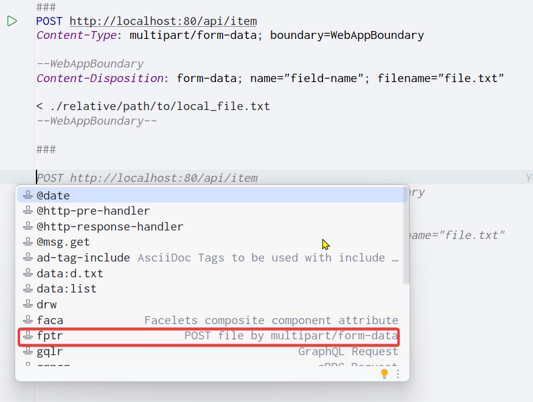

## 远程开发

> 下载 idea2021 之后的版本才有这个特性。

```shell
# 当前测试的idea版本为2022.3.3

# centOS8设置: 上传代码目录路径为 /root/workspace-git/ecommerce-all
# centOS8设置: 安装git命令，yum install git -y
# centOS8设置: 使用dcli程序安装docker、maven

# idea设置: 在idea中根据提示新建remote development信息，NOTE: 选择project directory为/root/workspace-git/ecommerce-all/ecommerce-parent，点击确认后需要等待idea下载相关组件并自动配置remote development环境
# idea设置: 使用Project Structure设置工程jdk目录
# idea设置: 使用Settings设置maven home centOS8的maven路径
# idea设置: 显示Git Commit tab，打开Settings>Version Control>Commit>Use non-modal commit interface
```


## 设置`multiple rows`显示`tabs`

打开 Settings 搜索 “tabs row”，然后勾选 “multiple rows”。

或者 Editor > General > Editor Tabs > Show tabs in > Multiple rows


## `Scratches`目录

IntelliJ IDEA 的 Scratches 目录是一个专门用于存储临时代码片段的区域。这个目录对于开发者来说非常有用，因为它允许开发者在不干扰当前项目文件的情况下，快速测试或记录一些临时的逻辑或代码。以下是对 IDEA Scratches 目录的详细解释：

### Scratches 目录的特点

1. 临时存储：
   - Scratches 目录中的文件是临时的，通常不用于长期存储或版本控制。
   - 这些文件不会与项目文件混淆，因为它们存储在专门的位置。
2. 跨项目访问：
   - 在 Scratches 目录中创建的文件可以在不同的项目之间访问。
   - 这意味着开发者可以在一个项目中创建临时文件，然后在另一个项目中继续编辑或使用它。
3. 支持多种语言：
   - Scratches 目录支持多种编程语言，包括 Java、Kotlin、Groovy 等。
   - 开发者可以使用这些语言编写和测试代码片段。
4. 可运行和调试：
   - Scratches 目录中的代码片段是可运行和可调试的。
   - 开发者可以点击左边栏的图标来运行或调试代码片段。

### 如何使用 Scratches 目录

1. 创建 Scratches 文件：
   - 可以通过文件菜单创建 Scratches 文件：File - New - Scratch File。
   - 也可以使用快捷键 Ctrl+Alt+Shift+Insert 来创建。
2. 管理 Scratches 文件：
   - Scratches 文件存储在 IDEA 的专门目录下，通常是在用户的配置目录中。
   - 开发者可以通过 IDEA 的设置或配置来查看和更改 Scratches 目录的位置。
3. 编辑和运行 Scratches 文件：
   - 可以在 Scratches 文件中编写代码，并使用 IDEA 的代码补全、语法高亮等功能。
   - 点击左边栏的图标来运行或调试代码片段。

### 注意事项

- **本地存储**：Scratches 目录中的文件是本地存储的，不适用于多人协作。
- **自动保存**：虽然 IDEA 通常会自动保存项目文件，但 Scratches 目录的自动保存行为可能因配置而异。为了确保不会丢失重要的临时代码，建议定期手动保存或使用版本控制系统来备份。
- **性能考虑**：由于 Scratches 目录中的文件是临时的，因此它们可能会对 IDEA 的性能产生一定影响。如果存储了大量的临时文件，可能会导致 IDEA 启动速度变慢或占用更多的内存。因此，建议定期清理不再需要的临时文件。

综上所述，IDEA 的 Scratches 目录是一个功能强大且灵活的工具，可以帮助开发者更好地管理和测试临时代码片段。通过合理使用 Scratches 目录，开发者可以提高开发效率并减少不必要的干扰。


## `HTTP Client`

### 介绍

IDEA HTTP Client是IntelliJ IDEA自带的一款简洁轻量级的接口调用插件，以下是对其的详细介绍：

一、功能概述

通过IDEA HTTP Client，用户可以在IDEA上开发、调试和测试RESTful Web服务。它提供了一个简单直观的HTTP请求编辑器，支持多种HTTP方法（如GET、POST、PUT、PATCH等），并允许用户配置请求头、请求体、代理、SSL证书等参数。此外，IDEA HTTP Client还支持保存常用请求模板、查看历史记录、导出请求为Curl或Postman格式等功能。

二、使用指南

1. **插件安装与启动**：
   - IDEA HTTP Client插件通常默认已安装启动。若未安装，可通过“File”-“Settings”-“Plugins”路径进行安装。
2. **创建请求文件**：
   - 在项目根目录下创建一个存储请求文件的文件夹。
   - 在文件夹中创建HTTP Client请求文件。
3. **添加请求**：
   - 打开创建的文件，点击右上角工具栏中的“add request”，选择相应的请求类型（如GET、POST等）。
   - 在请求编辑器中输入请求的URL、HTTP方法、请求头和请求体等信息。
4. **发送请求**：
   - 点击左边的运行按钮或按下快捷键（如“Alt+F12”）发送请求。
   - IDEA将显示响应结果，包括响应状态、响应头和响应体等信息。

三、请求示例

1. **GET请求示例**：
   - GET请求可以包含请求头、参数、环境变量等。
   - 示例：`GET https://httpbin.org/ip Accept: application/json`
2. **POST请求示例**：
   - POST请求可以包含JSON格式的请求体、表单字段和文件等。
   - 示例：`POST https://httpbin.org/post Content-Type:application/json { "id": 999, "value": "content" }`
3. **PUT/PATCH请求示例**：
   - PUT和PATCH请求通常用于更新资源。
   - 示例：`PUT http://localhost:8080/person/put Content-Type:application/json { "name": "name111", "age": 17 }`
4. **带鉴权验证的请求示例**：
   - IDEA HTTP Client支持Basic、Digest和Token等多种鉴权方式。
   - 示例：`GET https://httpbin.org/basic-auth/user/passwd Authorization: Basic user passwd`

四、高级功能

1. **动态变量**：
   - IDEA HTTP Client支持在请求中使用动态变量，如UUID、时间戳等。
   - 示例：`GET http://httpbin.org/anything?id={{$uuid}}&ts={{$timestamp}}`
2. **断言**：
   - 用户可以在请求中添加断言来验证响应结果是否符合预期。
3. **集成调试器**：
   - 发送请求时可以集成调试器，方便对请求和响应进行更深入的分析和调试。
4. **自定义插件**：
   - 如果需要更多功能，可以编写自定义插件来扩展HTTP客户端插件的功能。

五、更新与优化

随着IntelliJ IDEA版本的更新，HTTP Client插件也在不断优化和完善。例如，在IDEA 2024.1版本中，HTTP Client提供了更多身份验证选项，包括PKCE授权代码和设备授予流程，并支持令牌和身份验证请求的额外参数。此外，该版本还引入了新的图标和增强的Spring模型图可视化内容等优化功能。

综上所述，IDEA HTTP Client是一款功能强大且易于使用的接口调用插件。通过它，开发者可以更方便地测试和调试Web应用程序，提高开发效率。


### 使用


#### 创建 .http 文件

使用 Tools > HTTP Client > Create Request in HTTP Client 功能创建 .http 文件

新创建的 .http 文件存放在 Scratches 目录（本地临时存储目录）中，如果需要版本管理则手动复制到项目目录中。


#### .http 文件使用 `###` 作为代码片段描述说明

如下图所示：


#### 使用智能提示生成上传文件代码片段

>[参考链接](https://stackoverflow.com/questions/34384650/intellij-idea-rest-client-file-uploading)

在 .http 文件中，只需按 ctrl+j，IDEA 将弹出实时模板项，然后输入 fptr，IDEA 将完成示例代码，如图所示：




#### `POST` 请求提交 `json` 格式数据

```
### updateIncreaseCount
POST http://localhost:8080/api/v1/count/updateIncreaseCount
# 关键：指定请求体为 JSON 格式
Content-Type: application/json

[{
  "idempotentUuid": "1:order",
  "flag": "order"
},{
  "idempotentUuid": "2:order",
  "flag": "order"
}]
```

接口定义：

```java
/**
 * 递增计数器
 *
 * @return
 */
@PostMapping(value = "updateIncreaseCount")
public ObjectResponse<String> updateIncreaseCount(
        @RequestBody(required = false) List<IncreaseCountDTO> increaseCountDTOList) throws BusinessException {
    commonService.updateIncreaseCount(increaseCountDTOList);
    return ResponseUtils.successObject("成功递增");
}
```

`IncreaseCountDTO` 定义：

```java
@Data
public class IncreaseCountDTO {
    /**
     * 幂等标识，防止重复递增计数器
     */
    private String idempotentUuid;
    private String flag;

    /**
     *
     */
    public IncreaseCountDTO() {

    }

    /**
     * 幂等标识通过 idempotentUuidPrefix+":"+flag 生成，因为同一个订单建立两种 Cassandra 索引需要区分开幂等标识
     *
     * @param idempotentUuidPrefix
     * @param flag
     */
    public IncreaseCountDTO(String idempotentUuidPrefix, String flag) {
        this.idempotentUuid = idempotentUuidPrefix + ":" + flag;
        this.flag = flag;
    }
}
```

#### 中文乱码

>详细用法请参考本站[示例](https://gitee.com/dexterleslie/demonstration/tree/main/demo-idea/demo-idea-http-client-assist)

```java
package com.future.demo;

import cn.hutool.extra.servlet.ServletUtil;
import cn.hutool.json.JSONUtil;
import com.future.common.http.ObjectResponse;
import com.future.common.http.ResponseUtils;
import org.springframework.http.MediaType;
import org.springframework.stereotype.Controller;
import org.springframework.web.bind.annotation.PostMapping;
import org.springframework.web.bind.annotation.RequestMapping;

import javax.servlet.http.HttpServletResponse;

@Controller
@RequestMapping(value = "/api/v1/")
public class ApiController {

    /**
     * 协助测试Http Client中文乱码问题
     *
     * @param response
     */
    @PostMapping(value = "test1")
    public void test1(HttpServletResponse response) {
        response.setStatus(HttpServletResponse.SC_BAD_REQUEST);
        ObjectResponse<String> objectResponse = ResponseUtils.failObject(90001, "测试");
        String JSON = JSONUtil.toJsonStr(objectResponse);
        ServletUtil.write(response, JSON, MediaType.APPLICATION_JSON_UTF8_VALUE);
        // HTTP头Content-Type不响应MediaType.APPLICATION_JSON_UTF8_VALUE会导致中文乱码
        // ServletUtil.write(response, JSON, MediaType.APPLICATION_JSON_VALUE);
    }
}
```

## ~~`AI`插件 - 概述~~

>提示：使用AI编程工具了。

作出~~以下尝试，但没有成功：~~

- ~~`JetBrains`的`AI Assistant`需要登录，放弃。~~
- ~~`Bito`的`ChatGPT GPT-4o - Bito AI Code Assistant`需要登录，放弃。~~
- ~~`GitHub`的`github-copilot-intellij`使用`30`天后需要收费，放弃。~~
- ~~`Tabnine`的`AI Chat & Autocomplete for JavaScript, Python & more`需要登录，放弃~~。


## ~~`AI`插件 - `Baidu Comate`~~

>提示：使用AI编程工具了。
>
>~~说明：推荐使用阿里的通义灵码。~~

~~使用百度`Baidu Comate`作为`AI`插件（使用百度帐号登录`Baidu Comate`即可使用`Comate`智能代码补全功能）。~~


## ~~`AI`插件 - 通义灵码~~

>提示：使用AI编程工具了。
>
>~~说明：目前开发工作中使用的`AI`插件。~~

~~打开插件管理设置窗口，输入`Lingma`（提供商为`Alibaba Cloud`）后安装并重启`IDEA`，使用支付宝`App`扫码登录插件即可使用。~~

~~因为插件快捷键和`IDEA`快捷键冲突：打开`File` > `Settings` > `Keymap`功能，定位到`Lingma`插件并删除其中的`Ctrl + Shift + I`、`Ctrl + 向上箭头`快捷键。~~


## `IDEA`、`CLion`、`GoLand`、`PyCharm`、`DataGrid`等破解

> [idea系列2023破解教程](https://www.bilibili.com/read/cv26088967/)

### `Ubuntu`

1. 从官方下载`2023.2.5 Ultimate`版本的`idea`、`clion`、`goland`等

   >`IDEA`下载链接：https://www.jetbrains.com/idea/download/other.html

2. 解压`idea`并`start trail`，注意：不能使用`root`运行`idea.sh`，否则会报告`x-windows`相关错误

3. 下载微云中`idea/jihuo-tool-my.zip`，注意：`jihuo-tool-origin.zip`是别人编译的工具，`jihuo-tool-my.zip`中的`ja-netfilter`是自己从源代码编译的，所有`ja-netfilter`相关源码在自己`github`中可以找到

4. 下载后解压到任意目录

   ```bash
   unzip jihuo-tool-my.zip
   ```

5. 执行`jihuo-tool/scripts/install.sh`，注意：在`ubuntu`中不需要使用`sudo`执行`install.sh`脚本。

   ```bash
   sh install.sh
   ```

6. 重新启动`idea`

7. 运行`idea`后点击`Manage license`后填入下面对应的`activation code`点击激活后，过期时间会变为2025年(经过测试这个过期时间是假的，破解后能够永久激活)

   > 参考 [链接](https://docs.qq.com/doc/DZWFmak1WcVBhdENu)

8. 各个`IntelliJ`产品的破解码如下：

   ```
   # IDEA
   XIZQAN09CR-eyJsaWNlbnNlSWQiOiJYSVpRQU4wOUNSIiwibGljZW5zZWVOYW1lIjoia2lkZHkgaW5zZWFtcyIsImFzc2lnbmVlTmFtZSI6IiIsImFzc2lnbmVlRW1haWwiOiIiLCJsaWNlbnNlUmVzdHJpY3Rpb24iOiIiLCJjaGVja0NvbmN1cnJlbnRVc2UiOmZhbHNlLCJwcm9kdWN0cyI6W3siY29kZSI6IlBEQiIsImZhbGxiYWNrRGF0ZSI6IjIwMjUtMDgtMDEiLCJwYWlkVXBUbyI6IjIwMjUtMDgtMDEiLCJleHRlbmRlZCI6dHJ1ZX0seyJjb2RlIjoiUFNJIiwiZmFsbGJhY2tEYXRlIjoiMjAyNS0wOC0wMSIsInBhaWRVcFRvIjoiMjAyNS0wOC0wMSIsImV4dGVuZGVkIjp0cnVlfSx7ImNvZGUiOiJQUEMiLCJmYWxsYmFja0RhdGUiOiIyMDI1LTA4LTAxIiwicGFpZFVwVG8iOiIyMDI1LTA4LTAxIiwiZXh0ZW5kZWQiOnRydWV9LHsiY29kZSI6IlBDV01QIiwiZmFsbGJhY2tEYXRlIjoiMjAyNS0wOC0wMSIsInBhaWRVcFRvIjoiMjAyNS0wOC0wMSIsImV4dGVuZGVkIjp0cnVlfSx7ImNvZGUiOiJQUkIiLCJmYWxsYmFja0RhdGUiOiIyMDI1LTA4LTAxIiwicGFpZFVwVG8iOiIyMDI1LTA4LTAxIiwiZXh0ZW5kZWQiOnRydWV9LHsiY29kZSI6IlBQUyIsImZhbGxiYWNrRGF0ZSI6IjIwMjUtMDgtMDEiLCJwYWlkVXBUbyI6IjIwMjUtMDgtMDEiLCJleHRlbmRlZCI6dHJ1ZX0seyJjb2RlIjoiSUkiLCJmYWxsYmFja0RhdGUiOiIyMDI1LTA4LTAxIiwicGFpZFVwVG8iOiIyMDI1LTA4LTAxIiwiZXh0ZW5kZWQiOmZhbHNlfSx7ImNvZGUiOiJQR08iLCJmYWxsYmFja0RhdGUiOiIyMDI1LTA4LTAxIiwicGFpZFVwVG8iOiIyMDI1LTA4LTAxIiwiZXh0ZW5kZWQiOnRydWV9LHsiY29kZSI6IlBTVyIsImZhbGxiYWNrRGF0ZSI6IjIwMjUtMDgtMDEiLCJwYWlkVXBUbyI6IjIwMjUtMDgtMDEiLCJleHRlbmRlZCI6dHJ1ZX0seyJjb2RlIjoiUFdTIiwiZmFsbGJhY2tEYXRlIjoiMjAyNS0wOC0wMSIsInBhaWRVcFRvIjoiMjAyNS0wOC0wMSIsImV4dGVuZGVkIjp0cnVlfV0sIm1ldGFkYXRhIjoiMDEyMDIyMDgwMVBTQU4wMDAwMDUiLCJoYXNoIjoiVFJJQUw6LTEwMzUwMzQyMiIsImdyYWNlUGVyaW9kRGF5cyI6NywiYXV0b1Byb2xvbmdhdGVkIjpmYWxzZSwiaXNBdXRvUHJvbG9uZ2F0ZWQiOmZhbHNlfQ==-CoFOL4hCLVDFAdlOcxtyff4LA+HU4DIoRo+QTdjWbEuevzCGrh4ghKPWTCWT7YdMYoaaLGQfpR7DP8I2w4AxRMBH5T/KEUeNM70uTkdzIXboS460xZGLImtcte5hiD/U6k3P6NL2BVQgQwGTMRG5utlGdj1WtF/jb+yzp7+vaJiCt8uqqqXjEohapQsROTUihqtVRVkd9peAtS1gzKc39YEMnxu7Oggjuo797zMSnSswT5b4EVjgs+GJxL8RObb1o5xnKk8z4fCSRzVXD4tcVbwMXs/OVcr9+cgUYMiRCLhlHVOQJtb8F5r3IFYKFEPCPmwVAFHfmkMxC3uVmAcVsg==-MIIETDCCAjSgAwIBAgIBDTANBgkqhkiG9w0BAQsFADAYMRYwFAYDVQQDDA1KZXRQcm9maWxlIENBMB4XDTIwMTAxOTA5MDU1M1oXDTIyMTAyMTA5MDU1M1owHzEdMBsGA1UEAwwUcHJvZDJ5LWZyb20tMjAyMDEwMTkwggEiMA0GCSqGSIb3DQEBAQUAA4IBDwAwggEKAoIBAQCUlaUFc1wf+CfY9wzFWEL2euKQ5nswqb57V8QZG7d7RoR6rwYUIXseTOAFq210oMEe++LCjzKDuqwDfsyhgDNTgZBPAaC4vUU2oy+XR+Fq8nBixWIsH668HeOnRK6RRhsr0rJzRB95aZ3EAPzBuQ2qPaNGm17pAX0Rd6MPRgjp75IWwI9eA6aMEdPQEVN7uyOtM5zSsjoj79Lbu1fjShOnQZuJcsV8tqnayeFkNzv2LTOlofU/Tbx502Ro073gGjoeRzNvrynAP03pL486P3KCAyiNPhDs2z8/COMrxRlZW5mfzo0xsK0dQGNH3UoG/9RVwHG4eS8LFpMTR9oetHZBAgMBAAGjgZkwgZYwCQYDVR0TBAIwADAdBgNVHQ4EFgQUJNoRIpb1hUHAk0foMSNM9MCEAv8wSAYDVR0jBEEwP4AUo562SGdCEjZBvW3gubSgUouX8bOhHKQaMBgxFjAUBgNVBAMMDUpldFByb2ZpbGUgQ0GCCQDSbLGDsoN54TATBgNVHSUEDDAKBggrBgEFBQcDATALBgNVHQ8EBAMCBaAwDQYJKoZIhvcNAQELBQADggIBABqRoNGxAQct9dQUFK8xqhiZaYPd30TlmCmSAaGJ0eBpvkVeqA2jGYhAQRqFiAlFC63JKvWvRZO1iRuWCEfUMkdqQ9VQPXziE/BlsOIgrL6RlJfuFcEZ8TK3syIfIGQZNCxYhLLUuet2HE6LJYPQ5c0jH4kDooRpcVZ4rBxNwddpctUO2te9UU5/FjhioZQsPvd92qOTsV+8Cyl2fvNhNKD1Uu9ff5AkVIQn4JU23ozdB/R5oUlebwaTE6WZNBs+TA/qPj+5/we9NH71WRB0hqUoLI2AKKyiPw++FtN4Su1vsdDlrAzDj9ILjpjJKA1ImuVcG329/WTYIKysZ1CWK3zATg9BeCUPAV1pQy8ToXOq+RSYen6winZ2OO93eyHv2Iw5kbn1dqfBw1BuTE29V2FJKicJSu8iEOpfoafwJISXmz1wnnWL3V/0NxTulfWsXugOoLfv0ZIBP1xH9kmf22jjQ2JiHhQZP7ZDsreRrOeIQ/c4yR8IQvMLfC0WKQqrHu5ZzXTH4NO3CwGWSlTY74kE91zXB5mwWAx1jig+UXYc2w4RkVhy0//lOmVya/PEepuuTTI4+UJwC7qbVlh5zfhj8oTNUXgN0AOc+Q0/WFPl1aw5VV/VrO8FCoB15lFVlpKaQ1Yh+DVU8ke+rt9Th0BCHXe0uZOEmH0nOnH/0onD
   
   # pycharm
   WDV7B5UM4J-eyJsaWNlbnNlSWQiOiJXRFY3QjVVTTRKIiwibGljZW5zZWVOYW1lIjoia2lkZHkgaW5zZWFtcyIsImFzc2lnbmVlTmFtZSI6IiIsImFzc2lnbmVlRW1haWwiOiIiLCJsaWNlbnNlUmVzdHJpY3Rpb24iOiIiLCJjaGVja0NvbmN1cnJlbnRVc2UiOmZhbHNlLCJwcm9kdWN0cyI6W3siY29kZSI6IlBTSSIsImZhbGxiYWNrRGF0ZSI6IjIwMjUtMDgtMDEiLCJwYWlkVXBUbyI6IjIwMjUtMDgtMDEiLCJleHRlbmRlZCI6dHJ1ZX0seyJjb2RlIjoiUFBDIiwiZmFsbGJhY2tEYXRlIjoiMjAyNS0wOC0wMSIsInBhaWRVcFRvIjoiMjAyNS0wOC0wMSIsImV4dGVuZGVkIjp0cnVlfSx7ImNvZGUiOiJQQ1dNUCIsImZhbGxiYWNrRGF0ZSI6IjIwMjUtMDgtMDEiLCJwYWlkVXBUbyI6IjIwMjUtMDgtMDEiLCJleHRlbmRlZCI6dHJ1ZX0seyJjb2RlIjoiUEMiLCJmYWxsYmFja0RhdGUiOiIyMDI1LTA4LTAxIiwicGFpZFVwVG8iOiIyMDI1LTA4LTAxIiwiZXh0ZW5kZWQiOmZhbHNlfSx7ImNvZGUiOiJQV1MiLCJmYWxsYmFja0RhdGUiOiIyMDI1LTA4LTAxIiwicGFpZFVwVG8iOiIyMDI1LTA4LTAxIiwiZXh0ZW5kZWQiOnRydWV9XSwibWV0YWRhdGEiOiIwMTIwMjIwODAxUFNBTjAwMDAwNSIsImhhc2giOiJUUklBTDoyNjMyMTUzOTMiLCJncmFjZVBlcmlvZERheXMiOjcsImF1dG9Qcm9sb25nYXRlZCI6ZmFsc2UsImlzQXV0b1Byb2xvbmdhdGVkIjpmYWxzZX0=-S44u4zyBrYbltQAZezyCkBYsVU9HRftkKneJSWd2SsZMxgJiA1JfkhEl2yc4zrXBBqCCn2PKpaw8noyremrYtur0Iz93xp1geS6VSI4t5w5jgHR1CEUcL9Ia4BIl3CIMkxR3WXPrSGAt9jVitTmmCGGO9swTN4Hxey4iNNsEhkp8LDG949kRhN1ly00RH+p+rUP+FdVxwZ7e06rIV1c/8MGoJi4Z+7oyi+WnfIP+QIwxoNa60dzshI9Ep9d0p6bIR6eBKbNkfooWmp87mpOyN5QPupwF4q1KgS+LbFTeY/zZK6yP7tj+T2rbE3WI8MhnIviArGLs9DjZm20MwZTWvg==-MIIETDCCAjSgAwIBAgIBDTANBgkqhkiG9w0BAQsFADAYMRYwFAYDVQQDDA1KZXRQcm9maWxlIENBMB4XDTIwMTAxOTA5MDU1M1oXDTIyMTAyMTA5MDU1M1owHzEdMBsGA1UEAwwUcHJvZDJ5LWZyb20tMjAyMDEwMTkwggEiMA0GCSqGSIb3DQEBAQUAA4IBDwAwggEKAoIBAQCUlaUFc1wf+CfY9wzFWEL2euKQ5nswqb57V8QZG7d7RoR6rwYUIXseTOAFq210oMEe++LCjzKDuqwDfsyhgDNTgZBPAaC4vUU2oy+XR+Fq8nBixWIsH668HeOnRK6RRhsr0rJzRB95aZ3EAPzBuQ2qPaNGm17pAX0Rd6MPRgjp75IWwI9eA6aMEdPQEVN7uyOtM5zSsjoj79Lbu1fjShOnQZuJcsV8tqnayeFkNzv2LTOlofU/Tbx502Ro073gGjoeRzNvrynAP03pL486P3KCAyiNPhDs2z8/COMrxRlZW5mfzo0xsK0dQGNH3UoG/9RVwHG4eS8LFpMTR9oetHZBAgMBAAGjgZkwgZYwCQYDVR0TBAIwADAdBgNVHQ4EFgQUJNoRIpb1hUHAk0foMSNM9MCEAv8wSAYDVR0jBEEwP4AUo562SGdCEjZBvW3gubSgUouX8bOhHKQaMBgxFjAUBgNVBAMMDUpldFByb2ZpbGUgQ0GCCQDSbLGDsoN54TATBgNVHSUEDDAKBggrBgEFBQcDATALBgNVHQ8EBAMCBaAwDQYJKoZIhvcNAQELBQADggIBABqRoNGxAQct9dQUFK8xqhiZaYPd30TlmCmSAaGJ0eBpvkVeqA2jGYhAQRqFiAlFC63JKvWvRZO1iRuWCEfUMkdqQ9VQPXziE/BlsOIgrL6RlJfuFcEZ8TK3syIfIGQZNCxYhLLUuet2HE6LJYPQ5c0jH4kDooRpcVZ4rBxNwddpctUO2te9UU5/FjhioZQsPvd92qOTsV+8Cyl2fvNhNKD1Uu9ff5AkVIQn4JU23ozdB/R5oUlebwaTE6WZNBs+TA/qPj+5/we9NH71WRB0hqUoLI2AKKyiPw++FtN4Su1vsdDlrAzDj9ILjpjJKA1ImuVcG329/WTYIKysZ1CWK3zATg9BeCUPAV1pQy8ToXOq+RSYen6winZ2OO93eyHv2Iw5kbn1dqfBw1BuTE29V2FJKicJSu8iEOpfoafwJISXmz1wnnWL3V/0NxTulfWsXugOoLfv0ZIBP1xH9kmf22jjQ2JiHhQZP7ZDsreRrOeIQ/c4yR8IQvMLfC0WKQqrHu5ZzXTH4NO3CwGWSlTY74kE91zXB5mwWAx1jig+UXYc2w4RkVhy0//lOmVya/PEepuuTTI4+UJwC7qbVlh5zfhj8oTNUXgN0AOc+Q0/WFPl1aw5VV/VrO8FCoB15lFVlpKaQ1Yh+DVU8ke+rt9Th0BCHXe0uZOEmH0nOnH/0onD
   
   # datagrid
   FJVUHLU3X1-eyJsaWNlbnNlSWQiOiJGSlZVSExVM1gxIiwibGljZW5zZWVOYW1lIjoia2lkZHkgaW5zZWFtcyIsImFzc2lnbmVlTmFtZSI6IiIsImFzc2lnbmVlRW1haWwiOiIiLCJsaWNlbnNlUmVzdHJpY3Rpb24iOiIiLCJjaGVja0NvbmN1cnJlbnRVc2UiOmZhbHNlLCJwcm9kdWN0cyI6W3siY29kZSI6IlBEQiIsImZhbGxiYWNrRGF0ZSI6IjIwMjUtMDgtMDEiLCJwYWlkVXBUbyI6IjIwMjUtMDgtMDEiLCJleHRlbmRlZCI6dHJ1ZX0seyJjb2RlIjoiREIiLCJmYWxsYmFja0RhdGUiOiIyMDI1LTA4LTAxIiwicGFpZFVwVG8iOiIyMDI1LTA4LTAxIiwiZXh0ZW5kZWQiOmZhbHNlfSx7ImNvZGUiOiJQU0kiLCJmYWxsYmFja0RhdGUiOiIyMDI1LTA4LTAxIiwicGFpZFVwVG8iOiIyMDI1LTA4LTAxIiwiZXh0ZW5kZWQiOnRydWV9LHsiY29kZSI6IlBXUyIsImZhbGxiYWNrRGF0ZSI6IjIwMjUtMDgtMDEiLCJwYWlkVXBUbyI6IjIwMjUtMDgtMDEiLCJleHRlbmRlZCI6dHJ1ZX1dLCJtZXRhZGF0YSI6IjAxMjAyMjA4MDFQU0FOMDAwMDA1IiwiaGFzaCI6IlRSSUFMOi0yNDc1NjQ2MTIiLCJncmFjZVBlcmlvZERheXMiOjcsImF1dG9Qcm9sb25nYXRlZCI6ZmFsc2UsImlzQXV0b1Byb2xvbmdhdGVkIjpmYWxzZX0=-IWA8NqxA1nOvfTGTVFX4PNAWRswj0hTsqntqWZcqcYFz/zIobEAYmHm0Lks82E0mPcNCzt0LPW6BfUZCI8f4r5E1nsonNS40bDv44qAcjBmQaLf5XxZLyoKRzl7YacDuqql+NY3tInFBX8Q4PQu56aVsS6DOZmeoO4fC66Qtwg2z+A+kvVpSlB3+1Fqww7SHZMuQbLlEOVSHqO2tf4bJVTIMH/OSMph5CpY4uJ8iv7yeBX+WQpcOy4tv1AZNEY9tIKI8nRVbnVnZaAf5R2ng1AduGCVSOaU1/ElLPReBvXTG6gZHtjKDHlAy2kq6JIH/CCeG/3ZkDLB0GzB29aSgHA==-MIIETDCCAjSgAwIBAgIBDTANBgkqhkiG9w0BAQsFADAYMRYwFAYDVQQDDA1KZXRQcm9maWxlIENBMB4XDTIwMTAxOTA5MDU1M1oXDTIyMTAyMTA5MDU1M1owHzEdMBsGA1UEAwwUcHJvZDJ5LWZyb20tMjAyMDEwMTkwggEiMA0GCSqGSIb3DQEBAQUAA4IBDwAwggEKAoIBAQCUlaUFc1wf+CfY9wzFWEL2euKQ5nswqb57V8QZG7d7RoR6rwYUIXseTOAFq210oMEe++LCjzKDuqwDfsyhgDNTgZBPAaC4vUU2oy+XR+Fq8nBixWIsH668HeOnRK6RRhsr0rJzRB95aZ3EAPzBuQ2qPaNGm17pAX0Rd6MPRgjp75IWwI9eA6aMEdPQEVN7uyOtM5zSsjoj79Lbu1fjShOnQZuJcsV8tqnayeFkNzv2LTOlofU/Tbx502Ro073gGjoeRzNvrynAP03pL486P3KCAyiNPhDs2z8/COMrxRlZW5mfzo0xsK0dQGNH3UoG/9RVwHG4eS8LFpMTR9oetHZBAgMBAAGjgZkwgZYwCQYDVR0TBAIwADAdBgNVHQ4EFgQUJNoRIpb1hUHAk0foMSNM9MCEAv8wSAYDVR0jBEEwP4AUo562SGdCEjZBvW3gubSgUouX8bOhHKQaMBgxFjAUBgNVBAMMDUpldFByb2ZpbGUgQ0GCCQDSbLGDsoN54TATBgNVHSUEDDAKBggrBgEFBQcDATALBgNVHQ8EBAMCBaAwDQYJKoZIhvcNAQELBQADggIBABqRoNGxAQct9dQUFK8xqhiZaYPd30TlmCmSAaGJ0eBpvkVeqA2jGYhAQRqFiAlFC63JKvWvRZO1iRuWCEfUMkdqQ9VQPXziE/BlsOIgrL6RlJfuFcEZ8TK3syIfIGQZNCxYhLLUuet2HE6LJYPQ5c0jH4kDooRpcVZ4rBxNwddpctUO2te9UU5/FjhioZQsPvd92qOTsV+8Cyl2fvNhNKD1Uu9ff5AkVIQn4JU23ozdB/R5oUlebwaTE6WZNBs+TA/qPj+5/we9NH71WRB0hqUoLI2AKKyiPw++FtN4Su1vsdDlrAzDj9ILjpjJKA1ImuVcG329/WTYIKysZ1CWK3zATg9BeCUPAV1pQy8ToXOq+RSYen6winZ2OO93eyHv2Iw5kbn1dqfBw1BuTE29V2FJKicJSu8iEOpfoafwJISXmz1wnnWL3V/0NxTulfWsXugOoLfv0ZIBP1xH9kmf22jjQ2JiHhQZP7ZDsreRrOeIQ/c4yR8IQvMLfC0WKQqrHu5ZzXTH4NO3CwGWSlTY74kE91zXB5mwWAx1jig+UXYc2w4RkVhy0//lOmVya/PEepuuTTI4+UJwC7qbVlh5zfhj8oTNUXgN0AOc+Q0/WFPl1aw5VV/VrO8FCoB15lFVlpKaQ1Yh+DVU8ke+rt9Th0BCHXe0uZOEmH0nOnH/0onD
   
   # goland
   PSUYBOSE34-eyJsaWNlbnNlSWQiOiJQU1VZQk9TRTM0IiwibGljZW5zZWVOYW1lIjoia2lkZHkgaW5zZWFtcyIsImFzc2lnbmVlTmFtZSI6IiIsImFzc2lnbmVlRW1haWwiOiIiLCJsaWNlbnNlUmVzdHJpY3Rpb24iOiIiLCJjaGVja0NvbmN1cnJlbnRVc2UiOmZhbHNlLCJwcm9kdWN0cyI6W3siY29kZSI6IlBTSSIsImZhbGxiYWNrRGF0ZSI6IjIwMjUtMDgtMDEiLCJwYWlkVXBUbyI6IjIwMjUtMDgtMDEiLCJleHRlbmRlZCI6dHJ1ZX0seyJjb2RlIjoiUENXTVAiLCJmYWxsYmFja0RhdGUiOiIyMDI1LTA4LTAxIiwicGFpZFVwVG8iOiIyMDI1LTA4LTAxIiwiZXh0ZW5kZWQiOnRydWV9LHsiY29kZSI6IkdPIiwiZmFsbGJhY2tEYXRlIjoiMjAyNS0wOC0wMSIsInBhaWRVcFRvIjoiMjAyNS0wOC0wMSIsImV4dGVuZGVkIjpmYWxzZX0seyJjb2RlIjoiUEdPIiwiZmFsbGJhY2tEYXRlIjoiMjAyNS0wOC0wMSIsInBhaWRVcFRvIjoiMjAyNS0wOC0wMSIsImV4dGVuZGVkIjp0cnVlfSx7ImNvZGUiOiJQV1MiLCJmYWxsYmFja0RhdGUiOiIyMDI1LTA4LTAxIiwicGFpZFVwVG8iOiIyMDI1LTA4LTAxIiwiZXh0ZW5kZWQiOnRydWV9XSwibWV0YWRhdGEiOiIwMTIwMjIwODAxUFNBTjAwMDAwNSIsImhhc2giOiJUUklBTDotNTIzMzE4Njc5IiwiZ3JhY2VQZXJpb2REYXlzIjo3LCJhdXRvUHJvbG9uZ2F0ZWQiOmZhbHNlLCJpc0F1dG9Qcm9sb25nYXRlZCI6ZmFsc2V9-JWZKP0AJWKSXcl1Ep6poGhauD7GlLMbPVMompa2zVsDzjP2L82BvMo0RZTPYcGiLnP7YL7kHUNFrn2wJiNlXVwp9AnXUvVTspDqhf5MwZ/W0Aug0HpJB0BVSPM7KRL41wyN2DHGyvRJ/w4/s057IQEZWUUy2HUUM1E48WqezS7HlKQBVrrD+IFjHE2Xv4xaPt/KBFXTn+MwWBiYcKsIdDurNKjHdRwo/Gl0umRc8/CFMYK6nrgoWA13PAgHMZioQPc4DK2aVCbCDECpTGoMIsKl2jZJei+wPfOf9Ud9i0/95YEyoK8/XnkUBzsm19quFegTEVp3HhT/EMheCuvMmeQ==-MIIETDCCAjSgAwIBAgIBDTANBgkqhkiG9w0BAQsFADAYMRYwFAYDVQQDDA1KZXRQcm9maWxlIENBMB4XDTIwMTAxOTA5MDU1M1oXDTIyMTAyMTA5MDU1M1owHzEdMBsGA1UEAwwUcHJvZDJ5LWZyb20tMjAyMDEwMTkwggEiMA0GCSqGSIb3DQEBAQUAA4IBDwAwggEKAoIBAQCUlaUFc1wf+CfY9wzFWEL2euKQ5nswqb57V8QZG7d7RoR6rwYUIXseTOAFq210oMEe++LCjzKDuqwDfsyhgDNTgZBPAaC4vUU2oy+XR+Fq8nBixWIsH668HeOnRK6RRhsr0rJzRB95aZ3EAPzBuQ2qPaNGm17pAX0Rd6MPRgjp75IWwI9eA6aMEdPQEVN7uyOtM5zSsjoj79Lbu1fjShOnQZuJcsV8tqnayeFkNzv2LTOlofU/Tbx502Ro073gGjoeRzNvrynAP03pL486P3KCAyiNPhDs2z8/COMrxRlZW5mfzo0xsK0dQGNH3UoG/9RVwHG4eS8LFpMTR9oetHZBAgMBAAGjgZkwgZYwCQYDVR0TBAIwADAdBgNVHQ4EFgQUJNoRIpb1hUHAk0foMSNM9MCEAv8wSAYDVR0jBEEwP4AUo562SGdCEjZBvW3gubSgUouX8bOhHKQaMBgxFjAUBgNVBAMMDUpldFByb2ZpbGUgQ0GCCQDSbLGDsoN54TATBgNVHSUEDDAKBggrBgEFBQcDATALBgNVHQ8EBAMCBaAwDQYJKoZIhvcNAQELBQADggIBABqRoNGxAQct9dQUFK8xqhiZaYPd30TlmCmSAaGJ0eBpvkVeqA2jGYhAQRqFiAlFC63JKvWvRZO1iRuWCEfUMkdqQ9VQPXziE/BlsOIgrL6RlJfuFcEZ8TK3syIfIGQZNCxYhLLUuet2HE6LJYPQ5c0jH4kDooRpcVZ4rBxNwddpctUO2te9UU5/FjhioZQsPvd92qOTsV+8Cyl2fvNhNKD1Uu9ff5AkVIQn4JU23ozdB/R5oUlebwaTE6WZNBs+TA/qPj+5/we9NH71WRB0hqUoLI2AKKyiPw++FtN4Su1vsdDlrAzDj9ILjpjJKA1ImuVcG329/WTYIKysZ1CWK3zATg9BeCUPAV1pQy8ToXOq+RSYen6winZ2OO93eyHv2Iw5kbn1dqfBw1BuTE29V2FJKicJSu8iEOpfoafwJISXmz1wnnWL3V/0NxTulfWsXugOoLfv0ZIBP1xH9kmf22jjQ2JiHhQZP7ZDsreRrOeIQ/c4yR8IQvMLfC0WKQqrHu5ZzXTH4NO3CwGWSlTY74kE91zXB5mwWAx1jig+UXYc2w4RkVhy0//lOmVya/PEepuuTTI4+UJwC7qbVlh5zfhj8oTNUXgN0AOc+Q0/WFPl1aw5VV/VrO8FCoB15lFVlpKaQ1Yh+DVU8ke+rt9Th0BCHXe0uZOEmH0nOnH/0onD
   
   # clion
   CFUC0974F2-eyJsaWNlbnNlSWQiOiJDRlVDMDk3NEYyIiwibGljZW5zZWVOYW1lIjoia2lkZHkgaW5zZWFtcyIsImFzc2lnbmVlTmFtZSI6IiIsImFzc2lnbmVlRW1haWwiOiIiLCJsaWNlbnNlUmVzdHJpY3Rpb24iOiIiLCJjaGVja0NvbmN1cnJlbnRVc2UiOmZhbHNlLCJwcm9kdWN0cyI6W3siY29kZSI6IlBTSSIsImZhbGxiYWNrRGF0ZSI6IjIwMjUtMDgtMDEiLCJwYWlkVXBUbyI6IjIwMjUtMDgtMDEiLCJleHRlbmRlZCI6dHJ1ZX0seyJjb2RlIjoiUENXTVAiLCJmYWxsYmFja0RhdGUiOiIyMDI1LTA4LTAxIiwicGFpZFVwVG8iOiIyMDI1LTA4LTAxIiwiZXh0ZW5kZWQiOnRydWV9LHsiY29kZSI6IkNMIiwiZmFsbGJhY2tEYXRlIjoiMjAyNS0wOC0wMSIsInBhaWRVcFRvIjoiMjAyNS0wOC0wMSIsImV4dGVuZGVkIjpmYWxzZX0seyJjb2RlIjoiUFNXIiwiZmFsbGJhY2tEYXRlIjoiMjAyNS0wOC0wMSIsInBhaWRVcFRvIjoiMjAyNS0wOC0wMSIsImV4dGVuZGVkIjp0cnVlfSx7ImNvZGUiOiJQV1MiLCJmYWxsYmFja0RhdGUiOiIyMDI1LTA4LTAxIiwicGFpZFVwVG8iOiIyMDI1LTA4LTAxIiwiZXh0ZW5kZWQiOnRydWV9XSwibWV0YWRhdGEiOiIwMTIwMjIwODAxUFNBTjAwMDAwNSIsImhhc2giOiJUUklBTDotMjA0MTkyNDM5OCIsImdyYWNlUGVyaW9kRGF5cyI6NywiYXV0b1Byb2xvbmdhdGVkIjpmYWxzZSwiaXNBdXRvUHJvbG9uZ2F0ZWQiOmZhbHNlfQ==-f1foDndTa2abGqyTmiIMxYSRjoC16NxuD7QhoiOm0bzrHbqIuAXw7zsWC3U9RjqgWi/bj/8fjDpjywAFktScyATpClNXMzoR/nPJaY+J0iU+0ivubS9VERrIYL8O6WOT8PvNoqcdJ+MIK6jKY519y3VcUAd0N47ZKkpmzAOd9moR+j5ma3U8yuJno0oNtsAES7Lp3tzdMlhD7yn105jafY65bRPD8ezoc1c0GkFfsZ/1P3XPxoWeiS70wCSG32xNmcWygCROs3mnlDoamIv+K76G+jLlrR9csS/+vxWYaThfLKIvpwCDUX7xzdnXx8raXkr7c78ZshsNUQZuOgE8ww==-MIIETDCCAjSgAwIBAgIBDTANBgkqhkiG9w0BAQsFADAYMRYwFAYDVQQDDA1KZXRQcm9maWxlIENBMB4XDTIwMTAxOTA5MDU1M1oXDTIyMTAyMTA5MDU1M1owHzEdMBsGA1UEAwwUcHJvZDJ5LWZyb20tMjAyMDEwMTkwggEiMA0GCSqGSIb3DQEBAQUAA4IBDwAwggEKAoIBAQCUlaUFc1wf+CfY9wzFWEL2euKQ5nswqb57V8QZG7d7RoR6rwYUIXseTOAFq210oMEe++LCjzKDuqwDfsyhgDNTgZBPAaC4vUU2oy+XR+Fq8nBixWIsH668HeOnRK6RRhsr0rJzRB95aZ3EAPzBuQ2qPaNGm17pAX0Rd6MPRgjp75IWwI9eA6aMEdPQEVN7uyOtM5zSsjoj79Lbu1fjShOnQZuJcsV8tqnayeFkNzv2LTOlofU/Tbx502Ro073gGjoeRzNvrynAP03pL486P3KCAyiNPhDs2z8/COMrxRlZW5mfzo0xsK0dQGNH3UoG/9RVwHG4eS8LFpMTR9oetHZBAgMBAAGjgZkwgZYwCQYDVR0TBAIwADAdBgNVHQ4EFgQUJNoRIpb1hUHAk0foMSNM9MCEAv8wSAYDVR0jBEEwP4AUo562SGdCEjZBvW3gubSgUouX8bOhHKQaMBgxFjAUBgNVBAMMDUpldFByb2ZpbGUgQ0GCCQDSbLGDsoN54TATBgNVHSUEDDAKBggrBgEFBQcDATALBgNVHQ8EBAMCBaAwDQYJKoZIhvcNAQELBQADggIBABqRoNGxAQct9dQUFK8xqhiZaYPd30TlmCmSAaGJ0eBpvkVeqA2jGYhAQRqFiAlFC63JKvWvRZO1iRuWCEfUMkdqQ9VQPXziE/BlsOIgrL6RlJfuFcEZ8TK3syIfIGQZNCxYhLLUuet2HE6LJYPQ5c0jH4kDooRpcVZ4rBxNwddpctUO2te9UU5/FjhioZQsPvd92qOTsV+8Cyl2fvNhNKD1Uu9ff5AkVIQn4JU23ozdB/R5oUlebwaTE6WZNBs+TA/qPj+5/we9NH71WRB0hqUoLI2AKKyiPw++FtN4Su1vsdDlrAzDj9ILjpjJKA1ImuVcG329/WTYIKysZ1CWK3zATg9BeCUPAV1pQy8ToXOq+RSYen6winZ2OO93eyHv2Iw5kbn1dqfBw1BuTE29V2FJKicJSu8iEOpfoafwJISXmz1wnnWL3V/0NxTulfWsXugOoLfv0ZIBP1xH9kmf22jjQ2JiHhQZP7ZDsreRrOeIQ/c4yR8IQvMLfC0WKQqrHu5ZzXTH4NO3CwGWSlTY74kE91zXB5mwWAx1jig+UXYc2w4RkVhy0//lOmVya/PEepuuTTI4+UJwC7qbVlh5zfhj8oTNUXgN0AOc+Q0/WFPl1aw5VV/VrO8FCoB15lFVlpKaQ1Yh+DVU8ke+rt9Th0BCHXe0uZOEmH0nOnH/0onD
   ```


### `Windows11`

>注意：PyCharm2023.2.5需要使用Python3.7.0作为interpreter，否则（使用比Python3.7.0更新版本）在调试Python代码时会报告isAlive属性找不到错误，在较新的Python版本中，`threading.Thread`类的 `isAlive()`方法已经被弃用，并被 `is_alive()`方法取代。

1. 从官方下载`2023.2.5 Ultimate（ideaIU-2023.2.5.exe）`版本的`IDEA`、`CLion`、`GoLand`等

   >`IDEA`下载链接：https://www.jetbrains.com/idea/download/other.html

2. 根据提示安装`idea`并`start trail`

3. 下载微云中`idea/jihuo-tool-my.zip`，注意：`jihuo-tool-origin.zip`是别人编译的工具，`jihuo-tool-my.zip`中的`ja-netfilter`是自己从源代码编译的，所有`ja-netfilter`相关源码在自己`github`中可以找到

4. 下载`jihuo-tool-my.zip`后解压到任意目录

5. 双击运行`jihuo-tool/scripts/install-current-user.vbs`

6. 重新启动`idea`

7. 运行`idea`后点击`Manage license`后填入下面对应的`activation code`点击激活后，过期时间会变为2025年(经过测试这个过期时间是假的，破解后能够永久激活)

   > 参考 [链接](https://docs.qq.com/doc/DZWFmak1WcVBhdENu)

8. 手动创建`~/.m2/settings.xml`：用于`Maven`依赖加速下载

   ```xml
   <?xml version="1.0" encoding="UTF-8"?>
   
   <!--
   Licensed to the Apache Software Foundation (ASF) under one
   or more contributor license agreements.  See the NOTICE file
   distributed with this work for additional information
   regarding copyright ownership.  The ASF licenses this file
   to you under the Apache License, Version 2.0 (the
   "License"); you may not use this file except in compliance
   with the License.  You may obtain a copy of the License at
   
       http://www.apache.org/licenses/LICENSE-2.0
   
   Unless required by applicable law or agreed to in writing,
   software distributed under the License is distributed on an
   "AS IS" BASIS, WITHOUT WARRANTIES OR CONDITIONS OF ANY
   KIND, either express or implied.  See the License for the
   specific language governing permissions and limitations
   under the License.
   -->
   
   <!--
    | This is the configuration file for Maven. It can be specified at two levels:
    |
    |  1. User Level. This settings.xml file provides configuration for a single user,
    |                 and is normally provided in ${user.home}/.m2/settings.xml.
    |
    |                 NOTE: This location can be overridden with the CLI option:
    |
    |                 -s /path/to/user/settings.xml
    |
    |  2. Global Level. This settings.xml file provides configuration for all Maven
    |                 users on a machine (assuming they're all using the same Maven
    |                 installation). It's normally provided in
    |                 ${maven.home}/conf/settings.xml.
    |
    |                 NOTE: This location can be overridden with the CLI option:
    |
    |                 -gs /path/to/global/settings.xml
    |
    | The sections in this sample file are intended to give you a running start at
    | getting the most out of your Maven installation. Where appropriate, the default
    | values (values used when the setting is not specified) are provided.
    |
    |-->
   <settings xmlns="http://maven.apache.org/SETTINGS/1.0.0"
             xmlns:xsi="http://www.w3.org/2001/XMLSchema-instance"
             xsi:schemaLocation="http://maven.apache.org/SETTINGS/1.0.0 http://maven.apache.org/xsd/settings-1.0.0.xsd">
       <!-- localRepository
        | The path to the local repository maven will use to store artifacts.
        |
        | Default: ${user.home}/.m2/repository
       <localRepository>/path/to/local/repo</localRepository>
       -->
   
       <!-- interactiveMode
        | This will determine whether maven prompts you when it needs input. If set to false,
        | maven will use a sensible default value, perhaps based on some other setting, for
        | the parameter in question.
        |
        | Default: true
       <interactiveMode>true</interactiveMode>
       -->
   
       <!-- offline
        | Determines whether maven should attempt to connect to the network when executing a build.
        | This will have an effect on artifact downloads, artifact deployment, and others.
        |
        | Default: false
       <offline>false</offline>
       -->
   
       <!-- pluginGroups
        | This is a list of additional group identifiers that will be searched when resolving plugins by their prefix, i.e.
        | when invoking a command line like "mvn prefix:goal". Maven will automatically add the group identifiers
        | "org.apache.maven.plugins" and "org.codehaus.mojo" if these are not already contained in the list.
        |-->
       <pluginGroups>
           <!-- pluginGroup
            | Specifies a further group identifier to use for plugin lookup.
           <pluginGroup>com.your.plugins</pluginGroup>
           -->
       </pluginGroups>
   
       <!-- proxies
        | This is a list of proxies which can be used on this machine to connect to the network.
        | Unless otherwise specified (by system property or command-line switch), the first proxy
        | specification in this list marked as active will be used.
        |-->
       <proxies>
           <!-- proxy
            | Specification for one proxy, to be used in connecting to the network.
            |
           <proxy>
             <id>optional</id>
             <active>true</active>
             <protocol>http</protocol>
             <username>proxyuser</username>
             <password>proxypass</password>
             <host>proxy.host.net</host>
             <port>80</port>
             <nonProxyHosts>local.net|some.host.com</nonProxyHosts>
           </proxy>
           -->
       </proxies>
   
       <!-- servers
        | This is a list of authentication profiles, keyed by the server-id used within the system.
        | Authentication profiles can be used whenever maven must make a connection to a remote server.
        |-->
       <servers>
           <!-- server
            | Specifies the authentication information to use when connecting to a particular server, identified by
            | a unique name within the system (referred to by the 'id' attribute below).
            |
            | NOTE: You should either specify username/password OR privateKey/passphrase, since these pairings are
            |       used together.
            |
           <server>
             <id>deploymentRepo</id>
             <username>repouser</username>
             <password>repopwd</password>
           </server>
           -->
   
           <!-- Another sample, using keys to authenticate.
           <server>
             <id>siteServer</id>
             <privateKey>/path/to/private/key</privateKey>
             <passphrase>optional; leave empty if not used.</passphrase>
           </server>
           -->
       </servers>
   
       <!-- mirrors
        | This is a list of mirrors to be used in downloading artifacts from remote repositories.
        |
        | It works like this: a POM may declare a repository to use in resolving certain artifacts.
        | However, this repository may have problems with heavy traffic at times, so people have mirrored
        | it to several places.
        |
        | That repository definition will have a unique id, so we can create a mirror reference for that
        | repository, to be used as an alternate download site. The mirror site will be the preferred
        | server for that repository.
        |-->
       <mirrors>
           <!-- mirror
            | Specifies a repository mirror site to use instead of a given repository. The repository that
            | this mirror serves has an ID that matches the mirrorOf element of this mirror. IDs are used
            | for inheritance and direct lookup purposes, and must be unique across the set of mirrors.
            |
           <mirror>
             <id>mirrorId</id>
             <mirrorOf>repositoryId</mirrorOf>
             <name>Human Readable Name for this Mirror.</name>
             <url>http://my.repository.com/repo/path</url>
           </mirror>
            -->
           <!--
          <mirror>
            <id>central</id>
            <mirrorOf>*</mirrorOf>
            <name>Human Readable Name for this Mirror.</name>
            <url>http://127.0.0.1:8081/nexus/content/repositories/central/</url>
          </mirror>
          <mirror>
            <id>dex</id>
            <mirrorOf>*</mirrorOf>
            <name>Human Readable Name for this Mirror.</name>
            <url>http://127.0.0.1:8081/nexus/content/repositories/dex/</url>
          </mirror>
          -->
           <mirror>
               <id>alimaven</id>
               <name>aliyun maven</name>
               <url>https://maven.aliyun.com/nexus/content/groups/public/</url>
               <mirrorOf>central</mirrorOf>
           </mirror>
   
           <!-- 不阻止http -->
           <mirror>
               <id>maven-default-http-blocker</id>
               <mirrorOf>external:dont-match-anything-mate:*</mirrorOf>
               <name>Pseudo repository to mirror external repositories initially using HTTP.</name>
               <url>http://0.0.0.0/</url>
               <blocked>false</blocked>
           </mirror>
       </mirrors>
   
       <!-- profiles
        | This is a list of profiles which can be activated in a variety of ways, and which can modify
        | the build process. Profiles provided in the settings.xml are intended to provide local machine-
        | specific paths and repository locations which allow the build to work in the local environment.
        |
        | For example, if you have an integration testing plugin - like cactus - that needs to know where
        | your Tomcat instance is installed, you can provide a variable here such that the variable is
        | dereferenced during the build process to configure the cactus plugin.
        |
        | As noted above, profiles can be activated in a variety of ways. One way - the activeProfiles
        | section of this document (settings.xml) - will be discussed later. Another way essentially
        | relies on the detection of a system property, either matching a particular value for the property,
        | or merely testing its existence. Profiles can also be activated by JDK version prefix, where a
        | value of '1.4' might activate a profile when the build is executed on a JDK version of '1.4.2_07'.
        | Finally, the list of active profiles can be specified directly from the command line.
        |
        | NOTE: For profiles defined in the settings.xml, you are restricted to specifying only artifact
        |       repositories, plugin repositories, and free-form properties to be used as configuration
        |       variables for plugins in the POM.
        |
        |-->
       <profiles>
           <!-- profile
            | Specifies a set of introductions to the build process, to be activated using one or more of the
            | mechanisms described above. For inheritance purposes, and to activate profiles via <activatedProfiles/>
            | or the command line, profiles have to have an ID that is unique.
            |
            | An encouraged best practice for profile identification is to use a consistent naming convention
            | for profiles, such as 'env-dev', 'env-test', 'env-production', 'user-jdcasey', 'user-brett', etc.
            | This will make it more intuitive to understand what the set of introduced profiles is attempting
            | to accomplish, particularly when you only have a list of profile id's for debug.
            |
            | This profile example uses the JDK version to trigger activation, and provides a JDK-specific repo.
           <profile>
             <id>jdk-1.4</id>
   
             <activation>
               <jdk>1.4</jdk>
             </activation>
   
             <repositories>
               <repository>
                 <id>jdk14</id>
                 <name>Repository for JDK 1.4 builds</name>
                 <url>http://www.myhost.com/maven/jdk14</url>
                 <layout>default</layout>
                 <snapshotPolicy>always</snapshotPolicy>
               </repository>
             </repositories>
           </profile>
           -->
   
           <!--
            | Here is another profile, activated by the system property 'target-env' with a value of 'dev',
            | which provides a specific path to the Tomcat instance. To use this, your plugin configuration
            | might hypothetically look like:
            |
            | ...
            | <plugin>
            |   <groupId>org.myco.myplugins</groupId>
            |   <artifactId>myplugin</artifactId>
            |
            |   <configuration>
            |     <tomcatLocation>${tomcatPath}</tomcatLocation>
            |   </configuration>
            | </plugin>
            | ...
            |
            | NOTE: If you just wanted to inject this configuration whenever someone set 'target-env' to
            |       anything, you could just leave off the <value/> inside the activation-property.
            |
           <profile>
             <id>env-dev</id>
   
             <activation>
               <property>
                 <name>target-env</name>
                 <value>dev</value>
               </property>
             </activation>
   
             <properties>
               <tomcatPath>/path/to/tomcat/instance</tomcatPath>
             </properties>
           </profile>
   
           <profile>
             <id>nexus</id>
             <repositories>
               <repository>
                 <id>dex</id>
                 <name>Repository for dex</name>
                 <url>http://dex</url>
                 <releases><enabled>true</enabled></releases>
                 <snapshots><enabled>true</enabled></snapshots>
               </repository>
             </repositories>
           </profile>
           -->
   
       </profiles>
   
       <!-- activeProfiles
        | List of profiles that are active for all builds.
        |
       <activeProfiles>
         <activeProfile>alwaysActiveProfile</activeProfile>
         <activeProfile>anotherAlwaysActiveProfile</activeProfile>
       </activeProfiles>
       -->
   </settings>
   
   ```


## 高效开发

>提示：`IDEA`的快捷键容易与某些软件或者`IDEA`中第三方软件绑定的快捷键发生冲突，此时需要手动调整软件或者插件中绑定快捷键以取消冲突。

### 光标快速移动到单词

>说明：光标快速移动到上一个或者下一个单词。

`Ctrl + ←`或者`Ctrl + →`

### 在当前光标向上或者向下搜索关键字

`Ctrl + F`调出搜索框，输入关键字后按回车向下搜索关键词，`Shift + 回车`向上搜索关键词。

### 快速跳转到当前光标位置符号的定义

按下`Ctrl + B`跳转到类定义、跳转到方法定义、跳转到变量定义。

### 快速跳转到当前光标位置符号的实现

按下`Ctrl + Alt + B`跳转到方法实现、跳转到类的实现。

### 快速预览（不离开当前文件）

>说明：弹出小窗口显示定义，无需跳转页面。

`Ctrl + Shift + I`。

### 快速打开全局搜索对话框

在`IDEA`中连续两次按下`Shift`键即可弹出全局搜索对话框

### 快速定位`URL`接口

打开全局搜索对话框，输入`/url captchaimage`（表示在`URL`范围中搜索含有`captchaimage`关键字的`URL`接口），定位`URL`后按回车键即可打开`URL`所在的`Controller`。

### 保持光标位置不变向上或者向下滚动页面

`Ctrl + ↑`向上滚动页面，`Ctrl + ↓`向下滚动页面。

### 快速移动光标到当前页首行或者尾行

`Ctrl + PgUp`移动到首行，`Ctrl + PgDn`移动到尾行。

### 显示最近访问的文件列表，包含位置信息

`Ctrl + E`。

### 上一个或者下一个文件历史快速切换

>提示：导航历史（基于文件访问顺序）。

`Alt + ←`或者`Alt + →`。

### 上一个或者下一个光标位置历史快速切换

>提示：`Ctrl + Alt + ←` 或者`Ctrl + Alt + →`没有作用可能是快捷键冲突，此时需要移除冲突的快捷键即可。打开`File` > `Settings` > `keymap`功能，搜索`back`关键字，定位到`Back`快捷键绑定显示`Ctrl + Alt + 向左箭头`和`Button 4 Click`（说明快捷键绑定冲突），此时删除`Button 4 Click`重启`IDEA`后快捷键`Ctrl + Alt + 向左箭头`即可正常使用。
>
>提示：光标位置历史（基于光标移动）。

`Ctrl + Alt + ←`或者`Ctrl + Alt + →`。

### 打开文件结构

`Ctrl + F12`（如果不可用使用`Alt + 7`）

## IDEA运行应用报告Command line is too long错误

错误信息如下：

```
Error running HcpFileApplication. Command line is too long. 
Shorten the command line via JAR manifest or via a classpath file and rerun.
```

点击`Edit Configuration...`>`Modify options`>`Shorten command line`功能，选择`JAR manifest`选项即可。
