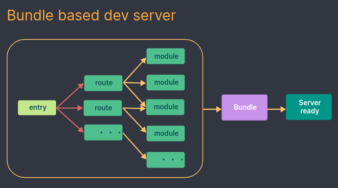
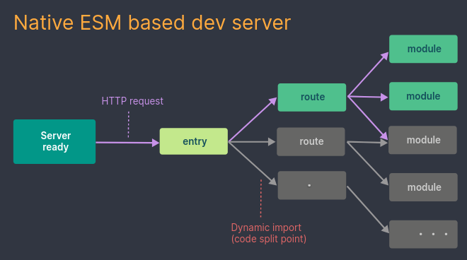

# Vite

>[Vite5 官方网站](https://v5.vite.dev/)
>
>[Vite2 官方网站](https://v2.vite.dev/)


## 介绍

Vite（法语意为 "快速的"，发音 `/vit/`，发音同 "veet"）是一种新型前端构建工具，能够显著提升前端开发体验。它主要由两部分组成：

- 一个开发服务器，它基于 [原生 ES 模块](https://developer.mozilla.org/en-US/docs/Web/JavaScript/Guide/Modules) 提供了 [丰富的内建功能](https://cn.vitejs.dev/guide/features.html)，如速度快到惊人的 [模块热替换（HMR）](https://cn.vitejs.dev/guide/features.html#hot-module-replacement)。
- 一套构建指令，它使用 [Rollup](https://rollupjs.org) 打包你的代码，并且它是预配置的，可输出用于生产环境的高度优化过的静态资源。

Vite 是一种具有明确建议的工具，具备合理的默认设置。您可以在 [功能指南](https://cn.vitejs.dev/guide/features.html) 中了解 Vite 的各种可能性。通过 [插件](https://cn.vitejs.dev/guide/using-plugins.html)，Vite 支持与其他框架或工具的集成。如有需要，您可以通过 [配置部分](https://cn.vitejs.dev/config/) 自定义适应你的项目。

Vite 还提供了强大的扩展性，可通过其 [插件 API](https://cn.vitejs.dev/guide/api-plugin.html) 和 [JavaScript API](https://cn.vitejs.dev/guide/api-javascript.html) 进行扩展，并提供完整的类型支持。

你可以在 [为什么选 Vite](https://cn.vitejs.dev/guide/why.html) 部分深入了解该项目的设计理念。


## 为什么选择 Vite？

### 现实问题 

在浏览器支持 ES 模块之前，JavaScript 并没有提供原生机制让开发者以模块化的方式进行开发。这也正是我们对 “打包” 这个概念熟悉的原因：使用工具抓取、处理并将我们的源码模块串联成可以在浏览器中运行的文件。

时过境迁，我们见证了诸如 [webpack](https://webpack.js.org/)、[Rollup](https://rollupjs.org) 和 [Parcel](https://parceljs.org/) 等工具的变迁，它们极大地改善了前端开发者的开发体验。

然而，当我们开始构建越来越大型的应用时，需要处理的 JavaScript 代码量也呈指数级增长。包含数千个模块的大型项目相当普遍。基于 JavaScript  开发的工具就会开始遇到性能瓶颈：通常需要很长时间（甚至是几分钟！）才能启动开发服务器，即使使用模块热替换（HMR），文件修改后的效果也需要几秒钟才能在浏览器中反映出来。如此循环往复，迟钝的反馈会极大地影响开发者的开发效率和幸福感。

Vite 旨在利用生态系统中的新进展解决上述问题：浏览器开始原生支持 ES 模块，且越来越多 JavaScript 工具使用编译型语言编写。


### 缓慢的服务器启动 

当冷启动开发服务器时，基于打包器的方式启动必须优先抓取并构建你的整个应用，然后才能提供服务。

Vite 通过在一开始将应用中的模块区分为 **依赖** 和 **源码** 两类，改进了开发服务器启动时间。

- **依赖** 大多为在开发时不会变动的纯 JavaScript。一些较大的依赖（例如有上百个模块的组件库）处理的代价也很高。依赖也通常会存在多种模块化格式（例如 ESM 或者 CommonJS）。

  Vite 将会使用 [esbuild](https://esbuild.github.io/) [预构建依赖](https://cn.vitejs.dev/guide/dep-pre-bundling.html)。esbuild 使用 Go 编写，并且比以 JavaScript 编写的打包器预构建依赖快 10-100 倍。

- **源码** 通常包含一些并非直接是 JavaScript 的文件，需要转换（例如 JSX，CSS 或者 Vue/Svelte 组件），时常会被编辑。同时，并不是所有的源码都需要同时被加载（例如基于路由拆分的代码模块）。

Vite 以 [原生 ESM](https://developer.mozilla.org/en-US/docs/Web/JavaScript/Guide/Modules) 方式提供源码。这实际上是让浏览器接管了打包程序的部分工作：Vite 只需要在浏览器请求源码时进行转换并按需提供源码。根据情景动态导入代码，即只在当前屏幕上实际使用时才会被处理。





### 缓慢的更新 

基于打包启动时，当源文件被修改后，重新构建整个包是低效的，原因显而易见：更新速度会随着应用体积的增加而线性下降。

一些打包器的开发服务器将构建内容存入内存，这样它们只需要在文件更改时使模块图的一部分失活[[1\]](https://cn.vitejs.dev/guide/why#footnote-1)，但它也仍需要整个重新构建并重载页面。这样代价很高，并且重新加载页面会消除应用的当前状态，所以打包器支持了动态模块热替换（HMR）：允许一个模块 “热替换” 它自己，而不会影响页面其余部分。这大大改进了开发体验 —— 然而，在实践中我们发现，即使采用了 HMR  模式，其热更新速度也会随着应用规模的增长而显著下降。

在 Vite 中，HMR 是在原生 ESM 上执行的。当编辑一个文件时，Vite 只需要精确地使已编辑的模块与其最近的 HMR 边界之间的链失活[[1\]](https://cn.vitejs.dev/guide/why#footnote-1)（大多数时候只是模块本身），使得无论应用大小如何，HMR 始终能保持快速更新。

Vite 同时利用 HTTP 头来加速整个页面的重新加载（再次让浏览器为我们做更多事情）：源码模块的请求会根据 `304 Not Modified` 进行协商缓存，而依赖模块请求则会通过 `Cache-Control: max-age=31536000,immutable` 进行强缓存，因此一旦被缓存它们将不需要再次请求。

一旦你体验到 Vite 的神速，你可能再也不想回到曾经的打包开发方式了。


## 创建 Vite+Vue3 项目

在目录 test1 创建一个新的 Vite 项目

```bash
npm create vite@latest test1
```

```bash
# 上面 npm create 命令输出
~/workspace-git/temp » npm create vite@latest test1
Need to install the following packages:
create-vite@6.3.1
Ok to proceed? (y) 
│
◇  Select a framework:
│  Vue
│
◇  Select a variant:
│  JavaScript
│
◇  Scaffolding project in /home/dexterleslie/workspace-git/temp/test1...
│
└  Done. Now run:

  cd test1
  npm install
  npm run dev

```

初始化项目依赖

```bash
npm install --registry=https://registry.npmmirror.com
```

运行项目

```bash
npm run dev
```


## 创建 Vite+Vue2 项目

>[参考链接1](https://blog.csdn.net/qq_39025670/article/details/122624997)
>
>[参考链接2](https://www.mathew-paul.nz/posts/how-to-use-vue2-with-vite/)

参考 <a href="/vue/脚手架创建项目.html#创建-vue2" target="_blank">链接</a> 创建一个空的 Vue2 项目

删除 vue.config.js 配置文件，因为 Vite 不需要此配置文件

安装 Vite 依赖

```bash
npm install vite@^4.0.0 -D --registry=https://registry.npmmirror.com

# 安装 Vite 对 Vue2 支持的插件
npm install vite-plugin-vue2 -D --registry=https://registry.npmmirror.com
```

新增 Vite 配置文件 vite.config.js

```javascript
import { defineConfig } from 'vite'
import { createVuePlugin } from 'vite-plugin-vue2';

export default defineConfig({
  plugins: [createVuePlugin()],
})
```

替换 package.json 中的 scripts 为如下内容：

```json
"scripts": {
    "dev": "vite",
    "build": "vite build",
    "preview": "vite preview"
},
```

在项目根目录中新增 index.html 内容如下：

```html
<!doctype html>
<html lang="en">
  <head>
    <meta charset="UTF-8" />
    <link rel="icon" type="image/svg+xml" href="/vite.svg" />
    <meta name="viewport" content="width=device-width, initial-scale=1.0" />
    <title>Vite + Vue2</title>
  </head>
  <body>
    <div id="app"></div>
    <script type="module" src="/src/main.js"></script>
  </body>
</html>
```

启动项目并测试

```bash
npm run dev
```


## 为现有项目添加 Vite 支持

进入项目目录后，执行以下命令为项目添加 Vite 支持

```bash
npm install -D vite --registry=https://registry.npmmirror.com
```

并创建一个像这样的 `index.html` 文件：

```html
<p>Hello Vite!</p>
```

然后在终端上运行相应的命令：

```bash
npx vite
```

之后就可以在 `http://localhost:5173` 上访问 `index.html`。

`package.json` 中配置 `vite` 命令行：

```json
{
  "scripts": {
    "dev": "vite", // 启动开发服务器，别名：`vite dev`，`vite serve`
    "build": "vite build", // 为生产环境构建产物
    "preview": "vite preview" // 本地预览生产构建产物
  }
}
```

配置 `vite` 命令行后即可使用以下命令启动 `vite` 支持的项目

```bash
npm run dev
```

